 

<!--# Bio

I received a Bachelor degree in Computer Science and Engineering at The Chinese University of Hong Kong, Shenzhen (CUHKSZ) in 2021.    
I am a Ph.D. student at the Hong Kong University of Science and Technology (Guangzhou) advised by [Prof. Lei Zhu](https://sites.google.com/site/indexlzhu/home).   
Mainly intrest in computer vision, especially in **Low-level Vision**.

[Google Scholar](https://scholar.google.com/citations?&user=KWbcBucAAAAJ) &nbsp;&nbsp;&nbsp;
[GitHub](https://github.com/haoyuc) &nbsp;&nbsp;&nbsp;
[Email](mailto:hchen794@connect.hkust-gz.edu.cn)

-->

  <!-- Left Column -->
  

    
    <!-- 
 -->
      <!-- <h1 style="margin-top:2px!important;">
        <name>Haoyu Chen</name>
      </h1>
    
PhD student @ HKUST(GZ)
 -->

  

    
    

      

        <strong style="color: rgb(90, 100, 120);">
          <a href="mailto:hchen794@connect.hkust-gz.edu.cn" style="color: rgb(90, 100, 120);" onmouseover="this.style.color='#006699';this.style.transition='color 0.3s ease'" onmouseout="this.style.color='#5A6478';">E-mail</a>
      </strong>
        <!-- @hchen794 -->
        <!-- @connect.hkust-gz.edu.cn -->
      

    

  

  

    
    

      

        <strong style="color: rgb(90, 100, 120);">
          <a href="https://scholar.google.com/citations?user=KWbcBucAAAAJ" style="color: rgb(90, 100, 120);" onmouseover="this.style.color='#006699';this.style.transition='color 0.3s ease'" onmouseout="this.style.color='#5A6478';">Scholar</a>
      </strong>
        <!-- @Haoyu Chen -->
        <!-- @connect.hkust-gz.edu.cn -->
      

    

  

  

    
    

      

        <strong style="color: rgb(90, 100, 120);">
          Github
      </strong>
        <a href="https://github.com/haoyuc" style="color: rgb(90, 100, 120);" onmouseover="this.style.color='#006699';this.style.transition='color 0.3s ease'" onmouseout="this.style.color='#5A6478';">@haoyuc</a>
      

    

  

  

  
  

    

      <strong style="color: rgb(90, 100, 120);">
        Wechat
    </strong>
    @haoyuc98
    

  

  <!-- 

  
悬停在 这里 显示新的文字。
 -->

<!-- 悬停在这里 -->

  

  <!-- Right Column -->
  

    <h1 style="margin-top:2px!important;">
        <name>Haoyu Chen</name>
    </h1>
    
PhD student @ HKUST(GZ)

    

    
I received a Bachelor degree in Computer Science and Engineering at The Chinese University of Hong Kong, Shenzhen (CUHKSZ) in 2021. 

    

        I am a Ph.D. student at the Hong Kong University of Science and Technology (Guangzhou) advised by <a href="https://sites.google.com/site/indexlzhu/home?authuser=0">Prof. Lei Zhu</a> and <a href="https://scholar.google.com/citations?user=XhyKVFMAAAAJ&hl=en">Prof. Ping Tan</a>.  
    

    

        Mainly intrest in computer vision, especially in Low-level Vision, Image Processing, Multi-Modal Models and Generative Models. 
    

        

        <!-- <a href="mailto:hchen794@connect.hkust-gz.edu.cn"> Email </a> &nbsp;/&nbsp; -->
        <!-- <a href="https://scholar.google.com/citations?&user=KWbcBucAAAAJ"> Google Scholar </a> &nbsp;/&nbsp; -->
        <!-- <a href="https://github.com/haoyuc"> GitHub </a>  -->
  
  
  

# News

<!-- - **2023-07**: Three papers to appear in ACM MM 2023.
- **2023-07**: One first author paper to appear in ICCV 2023.
- **2023-04**: One paper to appear in ICML 2023.
- **2023-02**: One first author paper to appear in CVPR 2023.  
- **2022-09**: I am now a Ph.D. student at HKUSTGZ. -->

<ul>
  <li><strong style="color: rgb(90, 100, 120);">2024-02</strong>: Two papers to appear in NeurIPS 2024.</li>
  <li><strong style="color: rgb(90, 100, 120);">2024-07</strong>: One paper to appear in ECCV 2024.</li>
  <li><strong style="color: rgb(90, 100, 120);">2024-02</strong>: Two papers to appear in CVPR 2024.</li>
  <li><strong style="color: rgb(90, 100, 120);">2023-07</strong>: Three papers to appear in ACM MM 2023.</li>
  <li><strong style="color: rgb(90, 100, 120);">2023-07</strong>: One first author paper to appear in ICCV 2023.</li>
  <li><strong style="color: rgb(90, 100, 120);">2023-04</strong>: One paper to appear in ICML 2023.</li>
  <li><strong style="color: rgb(90, 100, 120);">2023-02</strong>: One first author paper to appear in CVPR 2023.</li>
  <li><strong style="color: rgb(90, 100, 120);">2022-09</strong>: I am now a Ph.D. student at HKUSTGZ.</li>
</ul>

# Education

	
	

		

			<strong  style="font-size: 15px;">
				 The Hong Kong University of Science and Technology (Guangzhou)
		 </strong> 
     
			Ph.D. student, 2022 ~ present.
     
		

	

	
	

		

			<strong style="font-size: 15px;">
				 The Chinese University of Hong Kong, Shenzhen
		 </strong> 
     
			B.Eng., Major in Computer Science and Engineering, Sep 2017 - Jul 2021.
     
		

	

# Publications

 
&nbsp;&nbsp;  Multi-Modal Models and Generative Models

<table style="width:100%;border:0px;border-spacing:0px;border-collapse:separate;margin-right:auto;margin-left:auto;"><tbody>

<!-- =================================================================================== -->
  <tr>
    <td style="margin:5px;padding:5px;width:30%;max-width:30%" align="center" class="image-wrapper">
      
    </td>
    <td width="75%" valign="center" class="text-wrapper"> 
      
NeurIPS, 2024

      

        RestoreAgent: Autonomous Image Restoration Agent via Multimodal Large Language Models
      

      

      Haoyu Chen, Wenbo Li, Jinjin Gu, Jingjing Ren, Sixiang Chen, Tian Ye, Renjing Pei, Kaiwen Zhou, Fenglong Song, Lei Zhu
      

      <!-- <em>ACM Multimedia <strong>(ACM MM)</strong></em>, 2023 -->
     <!--   -->
      <a href="https://haoyuchen.com/RestoreAgent">[Website]</a> 
      <a href="https://arxiv.org/abs/2407.18035">[arxiv]</a> 
      <!-- <a href="https://github.com/catcathh/UltraPixel">[Code]</a> -->
      <!-- <a href="https://paperswithcode.com/dataset/pipal-perceptual-iqa-dataset">[Benchmark]</a>  -->
      <!-- <a href="https://www.jasongt.com/research-full">[CVPR 2022 NTIRE Challenge]</a>  -->
      <!-- <a href="https://www.youtube.com/watch?v=315Umwgpa6s">[Youtube]</a>  -->
      <!-- <a href="https://www.bilibili.com/video/BV1cr4y1P7s4">[Bilibili]</a>  -->
       
      <!-- 
 
          We propose a novel machine learning problem – the SRP problem as reconstructing high-quality data from unsatisfactory sensor data in industrial systems. 
      
 -->
    </td>
</tr>
<!-- =================================================================================== -->

<!-- =================================================================================== -->
  <tr>
    <td style="margin:5px;padding:5px;width:30%;max-width:30%" align="center" class="image-wrapper">
      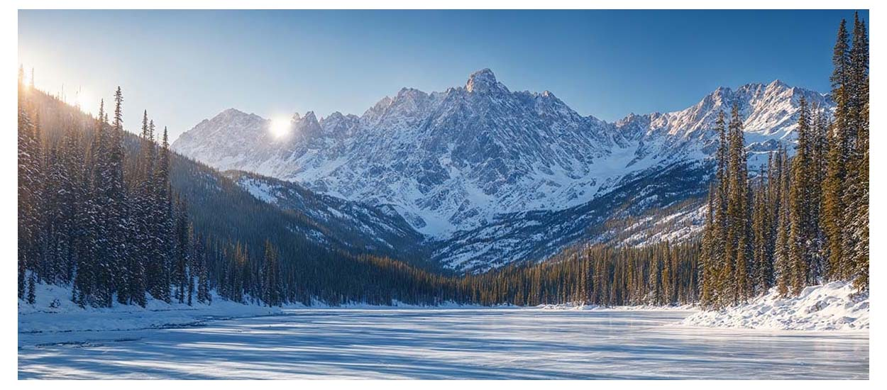
    </td>
    <td width="75%" valign="center" class="text-wrapper"> 
      
NeurIPS, 2024

      

        UltraPixel: Advancing Ultra-High-Resolution Image Synthesis to New Peaks
      

      

      Jingjing Ren*, Wenbo Li*, Haoyu Chen, Renjing Pei, Bin Shao, Yong Guo, Long Peng, Lei Zhu
      

      <!-- <em>ACM Multimedia <strong>(ACM MM)</strong></em>, 2023 -->
     <!--   -->
      <a href="https://jingjingrenabc.github.io/ultrapixel/">[Website]</a> 
      <a href="https://arxiv.org/abs/2407.02158">[arxiv]</a> 
      <a href="https://github.com/catcathh/UltraPixel">[Code]</a>
      <!-- <a href="https://paperswithcode.com/dataset/pipal-perceptual-iqa-dataset">[Benchmark]</a>  -->
      <!-- <a href="https://www.jasongt.com/research-full">[CVPR 2022 NTIRE Challenge]</a>  -->
      <!-- <a href="https://www.youtube.com/watch?v=315Umwgpa6s">[Youtube]</a>  -->
      <!-- <a href="https://www.bilibili.com/video/BV1cr4y1P7s4">[Bilibili]</a>  -->
       
      <!-- 
 
          We propose a novel machine learning problem – the SRP problem as reconstructing high-quality data from unsatisfactory sensor data in industrial systems. 
      
 -->
    </td>
</tr>
<!-- =================================================================================== -->

<!-- =================================================================================== -->
  <tr>
    <td style="margin:5px;padding:5px;width:30%;max-width:30%" align="center" class="image-wrapper">
      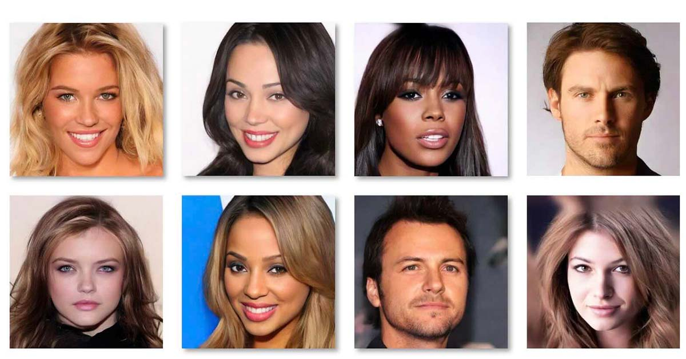
    </td>
    <td width="75%" valign="center" class="text-wrapper"> 
      
arXiv, 2023

      

        Towards Flexible, Scalable, and Adaptive Multi-Modal Conditioned Face Synthesis
      

      

      Jingjing Ren, Cheng Xu, Haoyu Chen, Xinran Qin, Chongyi Li, Lei Zhu
      

      

      <!-- <em>ACM Multimedia <strong>(ACM MM)</strong></em>, 2023 -->
      <a href="https://jingjingrenabc.github.io/multimodal-face-synthesis/">[Website]</a> 
      <a href="https://arxiv.org/abs/2312.16274">[arxiv]</a> 
      <!-- <a href="">[Code]</a> -->
      <!-- <a href="https://paperswithcode.com/dataset/pipal-perceptual-iqa-dataset">[Benchmark]</a>  -->
      <!-- <a href="https://www.jasongt.com/research-full">[CVPR 2022 NTIRE Challenge]</a>  -->
      <!-- <a href="https://www.youtube.com/watch?v=315Umwgpa6s">[Youtube]</a>  -->
      <!-- <a href="https://www.bilibili.com/video/BV1cr4y1P7s4">[Bilibili]</a>  -->
      

      <!--   -->
      <!-- 
 
          We propose a novel machine learning problem – the SRP problem as reconstructing high-quality data from unsatisfactory sensor data in industrial systems. 
      
 -->
    </td>
</tr>
<!-- =================================================================================== -->

    </tbody>
</table>

 
&nbsp;&nbsp; Generalizable Image Restoration

<table style="width:100%;border:0px;border-spacing:0px;border-collapse:separate;margin-right:auto;margin-left:auto;"><tbody>

<!-- =================================================================================== -->
  <tr>
    <td style="margin:5px;padding:5px;width:30%;max-width:30%" align="center" class="image-wrapper">
      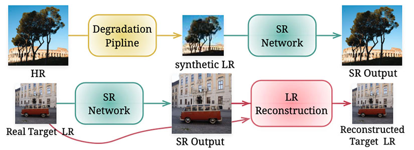
    </td>
    <td width="75%" valign="center" class="text-wrapper"> 
      
CVPR, 2024

      

        Low-Res Leads the Way: Improving Generalization for Super-Resolution by Self-Supervised Learning
      

      

      Haoyu Chen, Wenbo Li, Jinjin Gu, Jingjing Ren, Haoze Sun, Xueyi Zou, Youliang Yan, Zhensong Zhang, Lei Zhu
      

      <!-- <em>ACM Multimedia <strong>(ACM MM)</strong></em>, 2023 -->
     <!--   -->
      <a href="https://haoyuchen.com/LWay">[Website]</a> 
      <a href="https://arxiv.org/abs/2403.02601">[arxiv]</a> 
      <!-- <a href="">[Code]</a> -->
      <!-- <a href="https://paperswithcode.com/dataset/pipal-perceptual-iqa-dataset">[Benchmark]</a>  -->
      <!-- <a href="https://www.jasongt.com/research-full">[CVPR 2022 NTIRE Challenge]</a>  -->
      <!-- <a href="https://www.youtube.com/watch?v=315Umwgpa6s">[Youtube]</a>  -->
      <!-- <a href="https://www.bilibili.com/video/BV1cr4y1P7s4">[Bilibili]</a>  -->
       
      <!-- 
 
          We propose a novel machine learning problem – the SRP problem as reconstructing high-quality data from unsatisfactory sensor data in industrial systems. 
      
 -->
    </td>
</tr>
<!-- =================================================================================== -->

  <!-- =================================================================================== -->
  <tr>
    <td style="margin:5px;padding:5px;width:30%;max-width:30%" align="center" class="image-wrapper">
      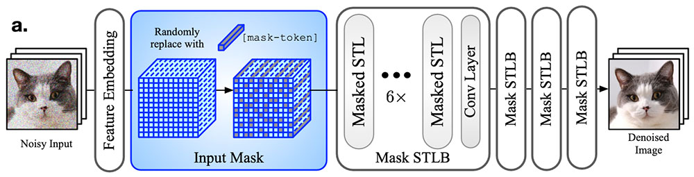
    </td>
    <td width="75%" valign="center" class="text-wrapper"> 
      
CVPR, 2023

      

        Masked Image Training for Generalizable Deep Image Denoising
      

      

      Haoyu Chen*, Jinjin Gu*, Yihao Liu, Salma Abdel Magid, Chao Dong, Qiong Wang, Hanspeter Pfister, Lei Zhu
      

      <!-- <em>IEEE Conference on Computer Vision and Pattern Recognition <strong>(CVPR)</strong></em>, 2023 -->
      <!--   -->
      <!-- <a href="https://www.jasongt.com/projectpages/pipal.html">[Website]</a>  -->
      <a href="https://arxiv.org/abs/2303.13132">[arxiv]</a> 
      <a href="https://github.com/haoyuc/MaskedDenoising">[Code]</a>
      <!-- <a href="https://paperswithcode.com/dataset/pipal-perceptual-iqa-dataset">[Benchmark]</a>  -->
      <!-- <a href="https://www.jasongt.com/research-full">[CVPR 2022 NTIRE Challenge]</a>  -->
      <!-- <a href="https://www.youtube.com/watch?v=315Umwgpa6s">[Youtube]</a>  -->
      <!-- <a href="https://www.bilibili.com/video/BV1cr4y1P7s4">[Bilibili]</a>  -->
   
      <!-- 
 
          We propose a novel machine learning problem – the SRP problem as reconstructing high-quality data from unsatisfactory sensor data in industrial systems. 
      
 -->
    </td>
</tr>
<!-- =================================================================================== -->

<!-- =================================================================================== -->
  <tr>
    <td style="margin:5px;padding:5px;width:30%;max-width:30%" align="center" class="image-wrapper">
      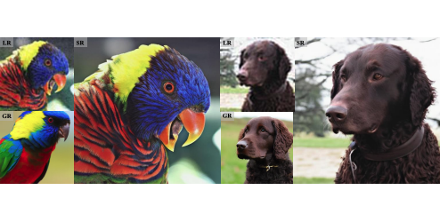
    </td>
    <td width="75%" valign="center" class="text-wrapper"> 
      
CVPR, 2024

      

        CoSeR: Bridging Image and Language for Cognitive Super-Resolution
      

      

      Haoze Sun, Wenbo Li, Jianzhuang Liu, Haoyu Chen, Renjing Pei, Xueyi Zou, Youliang Yan, Yujiu Yang
      

      <!-- <em>ACM Multimedia <strong>(ACM MM)</strong></em>, 2023 -->
     <!--   -->
      <a href="https://coser-main.github.io/">[Website]</a> 
      <a href="https://arxiv.org/abs/2311.16512">[arxiv]</a> 
      <a href="https://github.com/TianheWu/CoSeR">[Code]</a>
      <!-- <a href="https://paperswithcode.com/dataset/pipal-perceptual-iqa-dataset">[Benchmark]</a>  -->
      <!-- <a href="https://www.jasongt.com/research-full">[CVPR 2022 NTIRE Challenge]</a>  -->
      <!-- <a href="https://www.youtube.com/watch?v=315Umwgpa6s">[Youtube]</a>  -->
      <!-- <a href="https://www.bilibili.com/video/BV1cr4y1P7s4">[Bilibili]</a>  -->
       
      <!-- 
 
          We propose a novel machine learning problem – the SRP problem as reconstructing high-quality data from unsatisfactory sensor data in industrial systems. 
      
 -->
    </td>
</tr>
<!-- =================================================================================== -->

  <!-- =================================================================================== -->
  <tr>
    <td style="margin:5px;padding:5px;width:30%;max-width:30%" align="center" class="image-wrapper">
      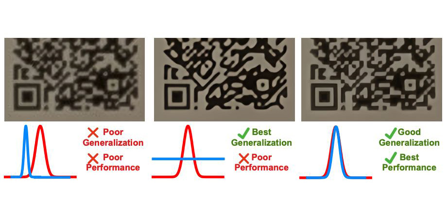
    </td>
    <td width="75%" valign="center" class="text-wrapper"> 
      
ICML, 2023

      

        Crafting Training Degradation Distribution for the Accuracy-Generalization Trade-off in Real-World Super-Resolution
      

      

      Ruofan Zhang, Jinjin Gu, Haoyu Chen, Chao Dong, Yulun Zhang, Wenming Yang
      

      <!-- <em>International Conference on Machine Learning <strong>(ICML)</strong></em>, 2023 -->
      <!--   -->
      <!-- <a href="https://www.jasongt.com/projectpages/pipal.html">[Website]</a>  -->
      <a href="https://arxiv.org/abs/2305.18107">[arxiv]</a> 
      <a href="">[Code]</a>
      <!-- <a href="https://paperswithcode.com/dataset/pipal-perceptual-iqa-dataset">[Benchmark]</a>  -->
      <!-- <a href="https://www.jasongt.com/research-full">[CVPR 2022 NTIRE Challenge]</a>  -->
      <!-- <a href="https://www.youtube.com/watch?v=315Umwgpa6s">[Youtube]</a>  -->
      <!-- <a href="https://www.bilibili.com/video/BV1cr4y1P7s4">[Bilibili]</a>  -->
   
      <!-- 
 
          We propose a novel machine learning problem – the SRP problem as reconstructing high-quality data from unsatisfactory sensor data in industrial systems. 
      
 -->
    </td>
</tr>
<!-- =================================================================================== -->

  

  <!-- =================================================================================== -->
  <tr>
    <td style="padding:5px;width:30%;max-width:30%" align="center" class="image-wrapper">
      
    </td>
    <td width="75%" valign="center"  class="text-wrapper">
      
arXiv, 2021

      

        Attention in Attention Network for Image Super-Resolution
      

      

      Haoyu Chen, Jinjin Gu, Zhi Zhang
      

      <!-- <em>arXiv</em>, 2021 -->
      <!--   -->
      <!-- <a href="https://www.jasongt.com/projectpages/pipal.html">[Website]</a>  -->
      <a href="https://arxiv.org/abs/2104.09497">[arxiv]</a> 
      <a href="https://github.com/haoyuc/A2N">[Code]</a>
      <!-- <a href="https://paperswithcode.com/dataset/pipal-perceptual-iqa-dataset">[Benchmark]</a>  -->
      <!-- <a href="https://www.jasongt.com/research-full">[CVPR 2022 NTIRE Challenge]</a>  -->
      <!-- <a href="https://www.youtube.com/watch?v=315Umwgpa6s">[Youtube]</a>  -->
      <!-- <a href="https://www.bilibili.com/video/BV1cr4y1P7s4">[Bilibili]</a>  -->
   
      <!-- 
 
          We propose a novel machine learning problem – the SRP problem as reconstructing high-quality data from unsatisfactory sensor data in industrial systems. 
      
 -->
    </td>
</tr>
<!-- =================================================================================== -->

  <!-- =================================================================================== -->
  <tr>
      <td style="margin:5px;padding:5px;width:30%;max-width:30%" align="center" class="image-wrapper">
        
      </td>
      <td width="75%" valign="center" class="text-wrapper">
        
ECCV, 2020

        

          PIPAL: a Large-Scale Image Quality Assessment Dataset for Perceptual Image Restoration
        

      

        Jinjin Gu, Haoming Cai, Haoyu Chen, Xiaoxin Ye, Jimmy S.Ren, Chao Dong
      

        <!-- <em>European Conference on Computer Vision  <strong>(ECCV)</strong></em>, 2020 -->
        <!--   -->
        <a href="https://www.jasongt.com/projectpages/pipal.html">[Website]</a> 
        <a href="https://arxiv.org/abs/2007.12142">[arxiv]</a> 
        <a href="https://github.com/HaomingCai/PIPAL-Codebase">[Code]</a>
        <a href="https://paperswithcode.com/dataset/pipal-perceptual-iqa-dataset">[Benchmark]</a> 
        <a href="https://www.jasongt.com/research-full">[CVPR 2022 NTIRE Challenge]</a> 
        <a href="https://www.youtube.com/watch?v=315Umwgpa6s">[Youtube]</a> 
        <a href="https://www.bilibili.com/video/BV1cr4y1P7s4">[Bilibili]</a> 
     
        <!-- 
 
            We propose a novel machine learning problem – the SRP problem as reconstructing high-quality data from unsatisfactory sensor data in industrial systems. 
        
 -->
      </td>
  </tr>
  <!-- =================================================================================== -->

    
    </tbody>
</table>

 
&nbsp;&nbsp;  Adverse Weather Restoration

<table style="width:100%;border:0px;border-spacing:0px;border-collapse:separate;margin-right:auto;margin-left:auto;"><tbody>

  <!-- =================================================================================== -->
  <tr>
    <td style="margin:5px;padding:5px;width:30%;max-width:30%" align="center" class="image-wrapper">
      
    </td>
    <td width="75%" valign="center" class="text-wrapper"> 
      
ICCV, 2023

      

        Snow Removal in Video: A New Dataset and A Novel Method
      

      

      Haoyu Chen, Jingjing Ren, Jinjin Gu, Hongtao Wu, Xuequan Lu, Haoming Cai, Lei Zhu
      

      <!-- <em>International Conference on Computer Vision <strong>(ICCV)</strong></em>, 2023 -->
      <!--   -->
      <!-- <a href="https://www.jasongt.com/projectpages/pipal.html">[Website]</a>  -->
      <a href="https://openaccess.thecvf.com/content/ICCV2023/html/Chen_Snow_Removal_in_Video_A_New_Dataset_and_A_Novel_ICCV_2023_paper.html">[arxiv]</a> 
      <a href="https://github.com/haoyuc/VideoDesnowing">[Code]</a>
      <a href="https://haoyuchen.com/VideoDesnowing">[Dataset]</a>
      <!-- <a href="https://paperswithcode.com/dataset/pipal-perceptual-iqa-dataset">[Benchmark]</a>  -->
      <!-- <a href="https://www.jasongt.com/research-full">[CVPR 2022 NTIRE Challenge]</a>  -->
      <!-- <a href="https://www.youtube.com/watch?v=315Umwgpa6s">[Youtube]</a>  -->
      <!-- <a href="https://www.bilibili.com/video/BV1cr4y1P7s4">[Bilibili]</a>  -->
   
      <!-- 
 
          We propose a novel machine learning problem – the SRP problem as reconstructing high-quality data from unsatisfactory sensor data in industrial systems. 
      
 -->
    </td>
</tr>
<!-- =================================================================================== -->

  <!-- =================================================================================== -->
  <tr>
    <td style="margin:5px;padding:5px;width:30%;max-width:30%" align="center" class="image-wrapper">
      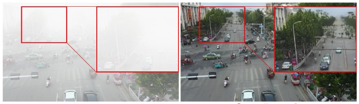
    </td>
    <td width="75%" valign="center" class="text-wrapper"> 
      
IJCV, 2024

      

        Triplane-Smoothed Video Dehazing with CLIP-Enhanced Generalization
      

      

      Jingjing Ren, Haoyu Chen, Tian Ye, Hongtao Wu, Lei Zhu
      

      <!-- <em>International Conference on Computer Vision <strong>(ICCV)</strong></em>, 2023 -->
      <!--   -->
      <!-- <a href="https://www.jasongt.com/projectpages/pipal.html">[Website]</a>  -->
      <a href="https://link.springer.com/article/10.1007/s11263-024-02161-0">[paper]</a> 
      <!-- <a href="https://github.com/haoyuc/VideoDesnowing">[Code]</a> -->
      <!-- <a href="https://haoyuchen.com/VideoDesnowing">[Dataset]</a> -->
      <!-- <a href="https://paperswithcode.com/dataset/pipal-perceptual-iqa-dataset">[Benchmark]</a>  -->
      <!-- <a href="https://www.jasongt.com/research-full">[CVPR 2022 NTIRE Challenge]</a>  -->
      <!-- <a href="https://www.youtube.com/watch?v=315Umwgpa6s">[Youtube]</a>  -->
      <!-- <a href="https://www.bilibili.com/video/BV1cr4y1P7s4">[Bilibili]</a>  -->
   
      <!-- 
 
          We propose a novel machine learning problem – the SRP problem as reconstructing high-quality data from unsatisfactory sensor data in industrial systems. 
      
 -->
    </td>
</tr>
<!-- =================================================================================== -->

<!-- =================================================================================== -->
  <tr>
    <td style="margin:5px;padding:5px;width:30%;max-width:30%" align="center" class="image-wrapper">
      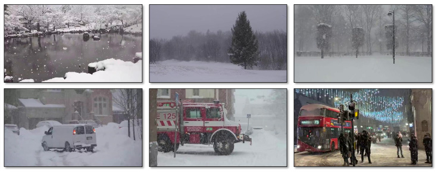
    </td>
    <td width="75%" valign="center" class="text-wrapper"> 
      
ECCV, 2024

      

        Semi-Supervised Video Desnowing Network via Temporal Decoupling Experts and Distribution-Driven Contrastive Regularization
      

      

      Hongtao Wu, Yijun Yang, Angelica Aviles-Rivero, Jingjing Ren, Sixiang Chen, Haoyu Chen, Lei Zhu
      

      <!-- <em>ACM Multimedia <strong>(ACM MM)</strong></em>, 2023 -->
     <!--   -->
      <!-- <a href="https://haoyuchen.com/LWay">[Website]</a>  -->
      <!-- <a href="https://arxiv.org/abs/2403.02601">[arxiv]</a>  -->
      <!-- <a href="">[Code]</a> -->
      <!-- <a href="https://paperswithcode.com/dataset/pipal-perceptual-iqa-dataset">[Benchmark]</a>  -->
      <!-- <a href="https://www.jasongt.com/research-full">[CVPR 2022 NTIRE Challenge]</a>  -->
      <!-- <a href="https://www.youtube.com/watch?v=315Umwgpa6s">[Youtube]</a>  -->
      <!-- <a href="https://www.bilibili.com/video/BV1cr4y1P7s4">[Bilibili]</a>  -->
       
      <!-- 
 
          We propose a novel machine learning problem – the SRP problem as reconstructing high-quality data from unsatisfactory sensor data in industrial systems. 
      
 -->
    </td>
</tr>
<!-- =================================================================================== -->

  <!-- =================================================================================== -->
  <tr>
    <td style="margin:5px;padding:5px;width:30%;max-width:30%" align="center" class="image-wrapper">
      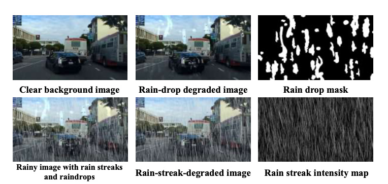
    </td>
    <td width="75%" valign="center" class="text-wrapper"> 
      
ACM MM, 2023

      

        Mask-Guided Progressive Network for Joint Raindrop and Rain Streak Removal in Videos
      

      

      Hongtao Wu, Yijun Yang, Haoyu Chen, Jingjing Ren, Lei Zhu
      

      <!-- <em>ACM Multimedia <strong>(ACM MM)</strong></em>, 2023 -->
     <!--   -->
      <!-- <a href="https://www.jasongt.com/projectpages/pipal.html">[Website]</a>  -->
      <a href="https://dl.acm.org/doi/pdf/10.1145/3581783.3612001">[paper]</a> 
      <!-- <a href="">[Code]</a> -->
      <!-- <a href="https://paperswithcode.com/dataset/pipal-perceptual-iqa-dataset">[Benchmark]</a>  -->
      <!-- <a href="https://www.jasongt.com/research-full">[CVPR 2022 NTIRE Challenge]</a>  -->
      <!-- <a href="https://www.youtube.com/watch?v=315Umwgpa6s">[Youtube]</a>  -->
      <!-- <a href="https://www.bilibili.com/video/BV1cr4y1P7s4">[Bilibili]</a>  -->
       
      <!-- 
 
          We propose a novel machine learning problem – the SRP problem as reconstructing high-quality data from unsatisfactory sensor data in industrial systems. 
      
 -->
    </td>
</tr>
<!-- =================================================================================== -->

    

  <!-- =================================================================================== -->
  <tr>
    <td style="margin:5px;padding:5px;width:30%;max-width:30%" align="center" class="image-wrapper">
      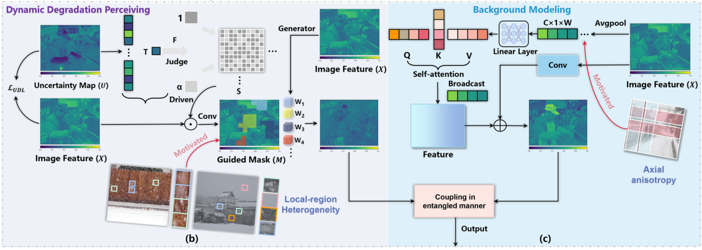
    </td>
    <td width="75%" valign="center" class="text-wrapper"> 
      
ACM MM, 2023

      

        Uncertainty-Driven Dynamic Degradation Perceiving and Background Modeling for Efficient Single Image Desnowing
      

      

      Sixiang Chen*, Tian Ye*, Chenghao Xue, Haoyu Chen, Yun Liu, Erkang Chen, Lei Zhu
      

      <!-- <em>ACM Multimedia <strong>(ACM MM)</strong></em>, 2023 -->
      <!--   -->
      <!-- <a href="https://www.jasongt.com/projectpages/pipal.html">[Website]</a>  -->
      <a href="https://dl.acm.org/pdf/10.1145/3581783.3612003">[paper]</a> 
      <!-- <a href="">[Code]</a> -->
      <!-- <a href="https://paperswithcode.com/dataset/pipal-perceptual-iqa-dataset">[Benchmark]</a>  -->
      <!-- <a href="https://www.jasongt.com/research-full">[CVPR 2022 NTIRE Challenge]</a>  -->
      <!-- <a href="https://www.youtube.com/watch?v=315Umwgpa6s">[Youtube]</a>  -->
      <!-- <a href="https://www.bilibili.com/video/BV1cr4y1P7s4">[Bilibili]</a>  -->
   
      <!-- 
 
          We propose a novel machine learning problem – the SRP problem as reconstructing high-quality data from unsatisfactory sensor data in industrial systems. 
      
 -->
    </td>
</tr>
<!-- =================================================================================== -->

  <!-- =================================================================================== -->
  <tr>
    <td style="margin:5px;padding:5px;width:30%;max-width:30%" align="center" class="image-wrapper">
      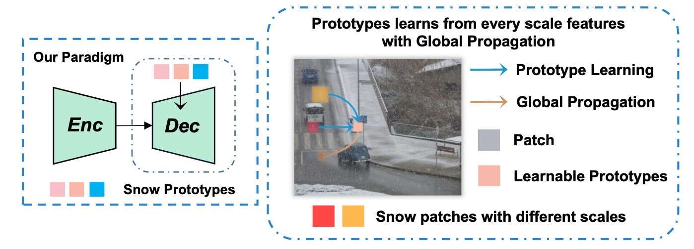
    </td>
    <td width="75%" valign="center" class="text-wrapper"> 
      
ACM MM, 2023

      

        Cross-scale Prototype Learning Transformer for Image Snow Removal
      

      

      Sixiang Chen*, Tian Ye*, Yun Liu, Jinbin Bai, Haoyu Chen, Yunlong Lin, Jun Shi, Erkang Chen
      

      <!-- <em>ACM Multimedia <strong>(ACM MM)</strong></em>, 2023 -->
    <!--   -->
      <!-- <a href="https://www.jasongt.com/projectpages/pipal.html">[Website]</a>  -->
      <a href="https://dl.acm.org/doi/pdf/10.1145/3581783.3611893">[paper]</a> 
      <!-- <a href="">[Code]</a> -->
      <!-- <a href="https://paperswithcode.com/dataset/pipal-perceptual-iqa-dataset">[Benchmark]</a>  -->
      <!-- <a href="https://www.jasongt.com/research-full">[CVPR 2022 NTIRE Challenge]</a>  -->
      <!-- <a href="https://www.youtube.com/watch?v=315Umwgpa6s">[Youtube]</a>  -->
      <!-- <a href="https://www.bilibili.com/video/BV1cr4y1P7s4">[Bilibili]</a>  -->
   
      <!-- 
 
          We propose a novel machine learning problem – the SRP problem as reconstructing high-quality data from unsatisfactory sensor data in industrial systems. 
      
 -->
    </td>
</tr>
<!-- =================================================================================== -->

    
    </tbody>
</table>

 
&nbsp;&nbsp;  Other

<table style="width:100%;border:0px;border-spacing:0px;border-collapse:separate;margin-right:auto;margin-left:auto;"><tbody>

  <!-- =================================================================================== -->
  <tr>
        <td style="margin:5px;padding:5px;width:30%;max-width:30%" align="center" class="image-wrapper">
          
        </td>
        <td width="75%" valign="center"  class="text-wrapper">
        
arXiv, 2018

        

        Super-resolution perception for industrial sensor data
      

      

        Jinjin Gu, Haoyu Chen, Guolong Liu, Gaoqi Liang, Xinlei Wang, Junhua Zhao             
      

        <!-- <em>arXiv</em>, 2018 -->
        <!--   -->
        <!-- <a href="https://sstzal.github.io/DFRF/">[Website]</a>  -->
        <a href="https://arxiv.org/abs/1809.06687">[arxiv]</a> 
        <!-- <a href="https://www.youtube.com/watch?v=F6fkVNk9bBw&amp;ab_channel=Shens">[Video]</a>  -->
        <!-- <a href="https://github.com/sstzal/DFRF">[Code]</a> -->
         
        <!-- 
 
          We propose a novel machine learning problem – the SRP problem as reconstructing high-quality data from unsatisfactory sensor data in industrial systems. 
        
 -->
      </td>
  </tr>
    <!-- =================================================================================== -->

    </tbody>
</table>

3 ***CVPR*** &nbsp;&nbsp; 1 ***ICCV*** &nbsp;&nbsp; 2 ***ECCV*** &nbsp;&nbsp; 1 ***ICML*** &nbsp;&nbsp; 3 ***ACM MM*** &nbsp;&nbsp; 4 ***arXiv***

 

<!--   -->

# Experience 

<!-- **Xiaobing.AI**.   
	Research Intern.  Mentor: [Dr. Baoyuan, Wang](https://scholar.google.com.hk/citations?user=OWa5rOEAAAAJ), ( 2021.6 ~ 2022.2 )

**AWS Shanghai AI Lab**.   
	Software Develop Engineer Intern. Mentor: [Zhi Zhang](https://scholar.google.com.hk/citations?user=nZr0oXQAAAAJ), ( 2020.5 ~ 2020.11 )   

**The Chinese University of Hong Kong. [GAP Lab](https://mypage.cuhk.edu.cn/academics/hanxiaoguang/index.html)**.   
	Research Assistant.  Advisor: [Dr. Xiaoguang, Han](https://mypage.cuhk.edu.cn/academics/hanxiaoguang/index.html), ( 2019.6 ~ 2021 )   

**Institute of Automation Chinese Academy of Sciences**.           
	Research Assistant. Advisor: [Dr. Bo Xu](http://people.ucas.edu.cn/~xubo_casia), ( 2018.8 ~ 2018.9 )        -->

	
	

		

			<strong>
				 Xiaobing.AI
		 </strong> 
     
			2021.6 ~ 2022.2. Research Intern.  <a href="https://scholar.google.com.hk/citations?user=OWa5rOEAAAAJ" target="_blank">Mentor: Dr. Baoyuan, Wang</a> 
     
		

	

	
	

		

			<strong>
				 Amazon Web Services Shanghai AI Lab
		 </strong> 
     
			2020.5 ~ 2020.11. Software Develop Engineer Intern. <a href="https://scholar.google.com.hk/citations?user=nZr0oXQAAAAJ" target="_blank">Mentor: Zhi Zhang</a>  
     
		

	

<!-- 

	<a name="fsaf" class="pull-left">
		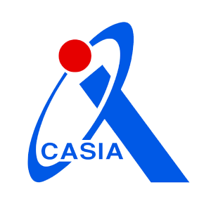
	</a>
	

		

			<strong>
				 Institute of Automation Chinese Academy of Sciences
		 </strong> 
			2018.8 ~ 2018.9.  Research Assistant. <a href="http://people.ucas.edu.cn/~xubo_casia">Advisor: Dr. Bo Xu</a>       
		

	

 -->

# Academic Service & Awards

**Competition Awards**   

IEEE ICDM 2018 global AI challenge on meteorology, 1st place.    
ECCV 2020 Workshop, AIM 2020 Challenge on Video Extreme Super-Resolution, 4th place.

**Program Committee / Reviewer**  

IEEE Conference on Computer Vision and Pattern Recognition (CVPR), 2024    
European Conference on Computer Vision (ECCV), 2024      
The International Conference on Learning Representations (ICLR), 2025.    
ACM Multimedia (ACM MM), 2023, 2024       
ACM SIGKDD Conference on Knowledge Discovery and Data Mining (KDD), 2023      
SIAM International Conference on Data Mining (SDM), 2024       
Winter Conference on Applications of Computer Vision (WACV), 2023, 2024     
ACM SIGGRAPH VRCAI, 2022      
IEEE Transactions on Circuits and Systems for Video Technology      
IEEE Transactions on Mobile Computing   
The Computer Vison      

# Hobbies & Interests

	
	

		

			<strong  style="color: rgb(90, 100, 120);">
				 Outdoor
		 </strong> 
		

	

	
	

		

			<strong  style="color: rgb(90, 100, 120);">
				 Travelling
		 </strong> 
		

	

	
	

		

			<strong  style="color: rgb(90, 100, 120);">
				 Tennis
		 </strong> 
		

	

	
	

		

			<strong  style="color: rgb(90, 100, 120);">
				 Music
		 </strong> 
		

	

<!--# Publications

Please refer to my [Publication](https://haoyuchen.com/portfolio/) or [Google Scholar](https://scholar.google.com/citations?&user=KWbcBucAAAAJ).

-->

<!-- 添加动画相关的CSS -->

<!-- 添加平滑滚动的JavaScript -->
