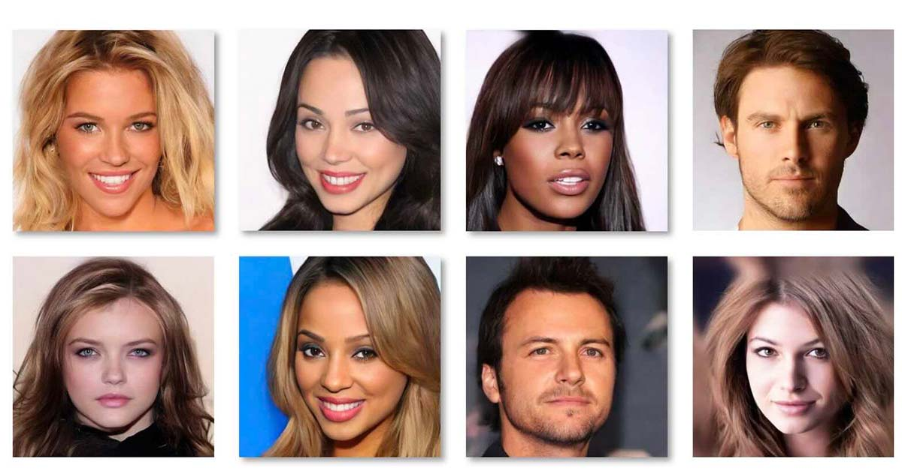
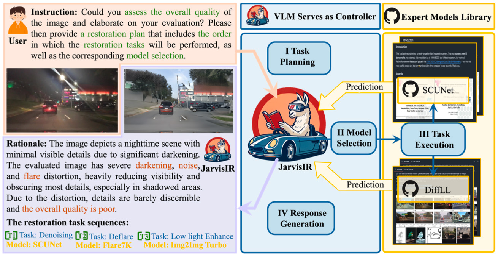
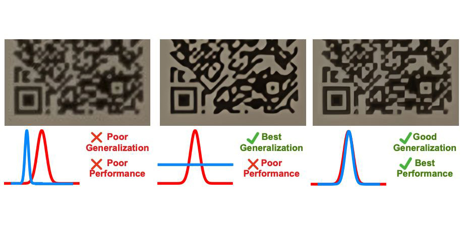
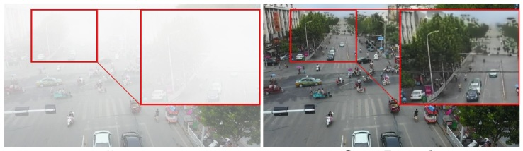

<!DOCTYPE html><html lang="en"><head><meta http-equiv="Content-Security-Policy" content="default-src 'self' 'unsafe-inline' 'unsafe-eval' data: blob: https://cdnjs.cloudflare.com https://cdn.jsdelivr.net https://code.jquery.com https://unpkg.com https://d3js.org https://threejs.org https://cdn.plot.ly https://stackpath.bootstrapcdn.com https://maps.googleapis.com https://cdn.tailwindcss.com https://ajax.googleapis.com https://kit.fontawesome.com https://cdn.datatables.net https://maxcdn.bootstrapcdn.com https://code.highcharts.com https://tako-static-assets-production.s3.amazonaws.com https://www.youtube.com https://fonts.googleapis.com https://fonts.gstatic.com https://pfst.cf2.poecdn.net https://puc.poecdn.net https://i.imgur.com https://wikimedia.org https://*.icons8.com https://*.giphy.com https://picsum.photos https://images.unsplash.com; frame-src 'self' https://www.youtube.com https://trytako.com; child-src 'self'; manifest-src 'self'; worker-src 'self'; upgrade-insecure-requests; block-all-mixed-content;">
    <meta charset="UTF-8">
    <meta name="viewport" content="width=device-width, initial-scale=1.0">
    <title>Haoyu Chen - Academic Portfolio</title>
    <link href="https://fonts.googleapis.com/css2?family=Inter:wght@300;400;500;600;700&amp;display=swap" rel="stylesheet">
    
    
    
</head>
<body class="min-h-screen bg-gray-50">
    <!-- Tooltip container -->
    

    <!-- Navigation -->
    <nav class="sticky top-0 z-50 bg-white shadow-sm">
        

            

                

                    Haoyu Chen
                

                

                    <a href="#home" class="nav-link px-2 py-1 text-gray-600 hover:text-gray-900">Home</a>
                    <a href="#news" class="nav-link px-2 py-1 text-gray-600 hover:text-gray-900">News</a>
                    <a href="#education" class="nav-link px-2 py-1 text-gray-600 hover:text-gray-900">Education</a>
                    <a href="#publications" class="nav-link px-2 py-1 text-gray-600 hover:text-gray-900">Publications</a>
                    <a href="#experience" class="nav-link px-2 py-1 text-gray-600 hover:text-gray-900">Experience</a>
                    <a href="#service" class="nav-link px-2 py-1 text-gray-600 hover:text-gray-900">Service</a>
                

            

        

    </nav>

    <main class="container mx-auto px-4 sm:px-6 lg:px-8 py-8">
        <!-- Bio Section -->
        <section id="home" class="pt-4 pb-12 max-w-6xl mx-auto bg-white rounded-xl shadow-sm p-8 mb-8">
            

                <!-- Left Column - Photo and Contact -->
                

                    

                        
                    

                    
                    

                        

                            

                                
                            

                            <a href="mailto:hchen794@connect.hkust-gz.edu.cn" class="contact-link text-gray-700 hover:text-primary-600 transition-colors">E-mail</a>
                        

                        
                        

                            

                                
                            

                            <a href="https://scholar.google.com/citations?user=KWbcBucAAAAJ" target="_blank" class="contact-link text-gray-700 hover:text-primary-600 transition-colors">Scholar</a>
                        

                        
                        

                            

                                
                            

                            

                                Github
                                <a href="https://github.com/haoyuc" target="_blank" class="contact-link text-gray-700 hover:text-primary-600 transition-colors">@haoyuc</a>
                            

                        

                        
                        

                            

                                
                            

                            

                                Wechat
                                @haoyuc98
                            

                        

                    

                

                
                <!-- Right Column - Bio Information -->
                

                    

                        <h1 class="text-3xl font-bold text-gray-900 mb-1">Haoyu Chen</h1>
                        
PhD student @ HKUST(GZ)

                    

                    
                    

                        

                            
I received a Bachelor degree in Computer Science and Engineering at The Chinese University of Hong Kong, Shenzhen (CUHKSZ) in 2021.

                        

                        
                        

                            
I am a Ph.D. student at the Hong Kong University of Science and Technology (Guangzhou) advised by 
                                <a href="https://sites.google.com/site/indexlzhu/home?authuser=0" class="text-primary-600 hover:underline font-medium">Prof. Lei Zhu</a> and 
                                <a href="https://scholar.google.com/citations?user=XhyKVFMAAAAJ&amp;hl=en" class="text-primary-600 hover:underline font-medium">Prof. Ping Tan</a>.
                            

                        

                        
                        

                            
Mainly interest in computer vision, especially in Low-level Vision, Image Processing, Multi-Modal Models and Generative Models.

                        

                    

                

            

        </section>
        
        <!-- News Section -->
        <section id="news" class="py-10 max-w-6xl mx-auto bg-white rounded-xl shadow-sm p-8 mb-8 animate-on-scroll">
            <h2 class="section-title">News</h2>
            
            

                

                    2025-02
                    Two papers to appear in CVPR 2025.
                

                

                    2024-09
                    Two papers to appear in NeurIPS 2024.
                

                

                    2024-07
                    One paper to appear in ECCV 2024.
                

                

                    2024-02
                    Two papers to appear in CVPR 2024.
                

                

                    2023-07
                    Three papers to appear in ACM MM 2023.
                

                

                    2023-07
                    One first author paper to appear in ICCV 2023.
                

                

                    2023-04
                    One paper to appear in ICML 2023.
                

                

                    2023-02
                    One first author paper to appear in CVPR 2023.
                

                

                    2022-09
                    I am now a Ph.D. student at HKUSTGZ.
                

            

        </section>
        
        <!-- Education Section -->
        <section id="education" class="py-10 max-w-6xl mx-auto bg-white rounded-xl shadow-sm p-8 mb-8 animate-on-scroll">
            <h2 class="section-title">Education</h2>
            
            

                

                    

                        

                            
                        

                        

                            <h3 class="text-lg font-semibold text-gray-900">The Hong Kong University of Science and Technology (Guangzhou)</h3>
                            
Ph.D. student, 2022 ~ present.

                        

                    

                

                
                

                    

                        

                            
                        

                        

                            <h3 class="text-lg font-semibold text-gray-900">The Chinese University of Hong Kong, Shenzhen</h3>
                            
B.Eng., Major in Computer Science and Engineering, Sep 2017 - Jul 2021.

                        

                    

                

            

        </section>
        
        <!-- Publications Section -->
        <section id="publications" class="py-10 max-w-6xl mx-auto bg-white rounded-xl shadow-sm p-8 mb-8 animate-on-scroll">
            <h2 class="section-title">Publications</h2>
            
            <!-- Generative Models Section -->
            

                <h3 class="paper-category">Generative Models and AIGC</h3>
                
                

                    <!-- POSTA Paper -->
                    

                        

                            

                                
                            

                            
CVPR, 2025

                            <h4 class="paper-title text-lg">POSTA: A Go-to Framework for Customized Artistic Poster Generation</h4>
                            

                                Haoyu Chen*, Xiaojie Xu*, Wenbo Li, Jingjing Ren, Tian Ye, Songhua Liu, Ying-Cong Chen, Lei Zhu, Xinchao Wang
                            

                            

                                <a href="https://haoyuchen.com/POSTA" class="text-primary-600 hover:underline text-sm font-medium">[Website]</a>
                                <a href="https://arxiv.org/abs/2503.14908" class="text-primary-600 hover:underline text-sm font-medium">[arxiv]</a>
                            

                        

                    

                    
                    <!-- UltraPixel Paper -->
                    

                        

                            

                                
                            

                            
NeurIPS, 2024

                            <h4 class="paper-title text-lg">UltraPixel: Advancing Ultra-High-Resolution Image Synthesis to New Peaks</h4>
                            

                                Jingjing Ren*, Wenbo Li*, Haoyu Chen, Renjing Pei, Bin Shao, Yong Guo, Long Peng, Lei Zhu
                            

                            

                                <a href="https://jingjingrenabc.github.io/ultrapixel/" class="text-primary-600 hover:underline text-sm font-medium">[Website]</a>
                                <a href="https://arxiv.org/abs/2407.02158" class="text-primary-600 hover:underline text-sm font-medium">[arxiv]</a>
                                <a href="https://github.com/catcathh/UltraPixel" class="text-primary-600 hover:underline text-sm font-medium">[Code]</a>
                                <a href="https://huggingface.co/spaces/roubaofeipi/UltraPixel-demo" class="text-primary-600 hover:underline text-sm font-medium">[Demo]</a>
                            

                        

                    

                    
                    <!-- Face Synthesis Paper -->
                    

                        

                            

                                
                            

                            
arXiv, 2023

                            <h4 class="paper-title text-lg">Towards Flexible, Scalable, and Adaptive Multi-Modal Conditioned Face Synthesis</h4>
                            

                                Jingjing Ren, Cheng Xu, Haoyu Chen, Xinran Qin, Chongyi Li, Lei Zhu
                            

                            

                                <a href="https://jingjingrenabc.github.io/multimodal-face-synthesis/" class="text-primary-600 hover:underline text-sm font-medium">[Website]</a>
                                <a href="https://arxiv.org/abs/2312.16274" class="text-primary-600 hover:underline text-sm font-medium">[arxiv]</a>
                            

                        

                    

                

            

            
            

            
            <!-- Multi-Modal Models Section -->
            

                <h3 class="paper-category">Multi-Modal Models and Agents</h3>
                
                

                    <!-- RestoreAgent Paper -->
                    

                        

                            

                                
                            

                            
NeurIPS, 2024

                            <h4 class="paper-title text-lg">RestoreAgent: Autonomous Image Restoration Agent via Multimodal Large Language Models</h4>
                            

                                Haoyu Chen, Wenbo Li, Jinjin Gu, Jingjing Ren, Sixiang Chen, Tian Ye, Renjing Pei, Kaiwen Zhou, Fenglong Song, Lei Zhu
                            

                            

                                <a href="https://haoyuchen.com/RestoreAgent" class="text-primary-600 hover:underline text-sm font-medium">[Website]</a>
                                <a href="https://arxiv.org/abs/2407.18035" class="text-primary-600 hover:underline text-sm font-medium">[arxiv]</a>
                            

                        

                    

                    
                    <!-- JarvisIR Paper -->
                    

                        

                            

                                
                            

                            
CVPR, 2025

                            <h4 class="paper-title text-lg">JarvisIR: Elevating Autonomous Driving Perception with Intelligent Image Restoration</h4>
                            

                                Yunlong Lin*, Zixu Lin*, Haoyu Chen*, Panwang Pan*, Chenxin Li, Sixiang Chen, Kairun Wen, Yeying Jin, Wenbo Li, Xinghao Ding
                            

                        

                    

                

            

            
            

            
            <!-- Image Restoration Section -->
            

                <h3 class="paper-category">Generalizable Image Restoration</h3>
                
                

                    <!-- LWay Paper -->
                    

                        

                            

                                
                            

                            
CVPR, 2024

                            <h4 class="paper-title text-lg">Low-Res Leads the Way: Improving Generalization for Super-Resolution by Self-Supervised Learning</h4>
                            

                                Haoyu Chen, Wenbo Li, Jinjin Gu, Jingjing Ren, Haoze Sun, Xueyi Zou, Youliang Yan, Zhensong Zhang, Lei Zhu
                            

                            

                                <a href="https://haoyuchen.com/LWay" class="text-primary-600 hover:underline text-sm font-medium">[Website]</a>
                                <a href="https://arxiv.org/abs/2403.02601" class="text-primary-600 hover:underline text-sm font-medium">[arxiv]</a>
                            

                        

                    

                    
                    <!-- Masked Denoising Paper -->
                    

                        

                            

                                
                            

                            
CVPR, 2023

                            <h4 class="paper-title text-lg">Masked Image Training for Generalizable Deep Image Denoising</h4>
                            

                                Haoyu Chen*, Jinjin Gu*, Yihao Liu, Salma Abdel Magid, Chao Dong, Qiong Wang, Hanspeter Pfister, Lei Zhu
                            

                            

                                <a href="https://arxiv.org/abs/2303.13132" class="text-primary-600 hover:underline text-sm font-medium">[arxiv]</a>
                                <a href="https://github.com/haoyuc/MaskedDenoising" class="text-primary-600 hover:underline text-sm font-medium">[Code]</a>
                            

                        

                    

                    
                    <!-- CoSeR Paper -->
                    

                        

                            

                                
                            

                            
CVPR, 2024

                            <h4 class="paper-title text-lg">CoSeR: Bridging Image and Language for Cognitive Super-Resolution</h4>
                            

                                Haoze Sun, Wenbo Li, Jianzhuang Liu, Haoyu Chen, Renjing Pei, Xueyi Zou, Youliang Yan, Yujiu Yang
                            

                            

                                <a href="https://coser-main.github.io/" class="text-primary-600 hover:underline text-sm font-medium">[Website]</a>
                                <a href="https://arxiv.org/abs/2311.16512" class="text-primary-600 hover:underline text-sm font-medium">[arxiv]</a>
                                <a href="https://github.com/TianheWu/CoSeR" class="text-primary-600 hover:underline text-sm font-medium">[Code]</a>
                            

                        

                    

                    
                    <!-- ICML Paper -->
                    

                        

                            

                                
                            

                            
ICML, 2023

                            <h4 class="paper-title text-lg">Crafting Training Degradation Distribution for the Accuracy-Generalization Trade-off in Real-World Super-Resolution</h4>
                            

                                Ruofan Zhang, Jinjin Gu, Haoyu Chen, Chao Dong, Yulun Zhang, Wenming Yang
                            

                            

                                <a href="https://arxiv.org/abs/2305.18107" class="text-primary-600 hover:underline text-sm font-medium">[arxiv]</a>
                                <a href="#" class="text-primary-600 hover:underline text-sm font-medium">[Code]</a>
                            

                        

                    

                    
                    <!-- A2N Paper -->
                    

                        

                            

                                
                            

                            
arXiv, 2021

                            <h4 class="paper-title text-lg">Attention in Attention Network for Image Super-Resolution</h4>
                            

                                Haoyu Chen, Jinjin Gu, Zhi Zhang
                            

                            

                                <a href="https://arxiv.org/abs/2104.09497" class="text-primary-600 hover:underline text-sm font-medium">[arxiv]</a>
                                <a href="https://github.com/haoyuc/A2N" class="text-primary-600 hover:underline text-sm font-medium">[Code]</a>
                            

                        

                    

                    
                    <!-- PIPAL Paper -->
                    

                        

                            

                                
                            

                            
ECCV, 2020

                            <h4 class="paper-title text-lg">PIPAL: a Large-Scale Image Quality Assessment Dataset for Perceptual Image Restoration</h4>
                            

                                Jinjin Gu, Haoming Cai, Haoyu Chen, Xiaoxin Ye, Jimmy S.Ren, Chao Dong
                            

                            

                                <a href="https://www.jasongt.com/projectpages/pipal.html" class="text-primary-600 hover:underline text-sm font-medium">[Website]</a>
                                <a href="https://arxiv.org/abs/2007.12142" class="text-primary-600 hover:underline text-sm font-medium">[arxiv]</a>
                                <a href="https://github.com/HaomingCai/PIPAL-Codebase" class="text-primary-600 hover:underline text-sm font-medium">[Code]</a>
                                <a href="https://paperswithcode.com/dataset/pipal-perceptual-iqa-dataset" class="text-primary-600 hover:underline text-sm font-medium">[Benchmark]</a>
                            

                        

                    

                

            

            
            

            
            <!-- Adverse Weather Section -->
            

                <h3 class="paper-category">Adverse Weather Restoration</h3>
                
                

                    <!-- Snow Removal Paper -->
                    

                        

                            

                                
                            

                            
ICCV, 2023

                            <h4 class="paper-title text-lg">Snow Removal in Video: A New Dataset and A Novel Method</h4>
                            

                                Haoyu Chen, Jingjing Ren, Jinjin Gu, Hongtao Wu, Xuequan Lu, Haoming Cai, Lei Zhu
                            

                            

                                <a href="https://openaccess.thecvf.com/content/ICCV2023/html/Chen_Snow_Removal_in_Video_A_New_Dataset_and_A_Novel_ICCV_2023_paper.html" class="text-primary-600 hover:underline text-sm font-medium">[paper]</a>
                                <a href="https://github.com/haoyuc/VideoDesnowing" class="text-primary-600 hover:underline text-sm font-medium">[Code]</a>
                                <a href="https://haoyuchen.com/VideoDesnowing" class="text-primary-600 hover:underline text-sm font-medium">[Dataset]</a>
                            

                        

                    

                    
                    <!-- Dehazing Paper -->
                    

                        

                            

                                
                            

                            
IJCV, 2024

                            <h4 class="paper-title text-lg">Triplane-Smoothed Video Dehazing with CLIP-Enhanced Generalization</h4>
                            

                                Jingjing Ren, Haoyu Chen, Tian Ye, Hongtao Wu, Lei Zhu
                            

                            

                                <a href="https://link.springer.com/article/10.1007/s11263-024-02161-0" class="text-primary-600 hover:underline text-sm font-medium">[paper]</a>
                            

                        

                    

                    
                    <!-- ECCV 2024 Paper -->
                    

                        

                            

                                
                            

                            
ECCV, 2024

                            <h4 class="paper-title text-lg">Semi-Supervised Video Desnowing Network via Temporal Decoupling Experts and Distribution-Driven Contrastive Regularization</h4>
                            

                                Hongtao Wu, Yijun Yang, Angelica Aviles-Rivero, Jingjing Ren, Sixiang Chen, Haoyu Chen, Lei Zhu
                            

                        

                    

                    
                    <!-- ACM MM Rain Paper -->
                    

                        

                            

                                
                            

                            
ACM MM, 2023

                            <h4 class="paper-title text-lg">Mask-Guided Progressive Network for Joint Raindrop and Rain Streak Removal in Videos</h4>
                            

                                Hongtao Wu, Yijun Yang, Haoyu Chen, Jingjing Ren, Lei Zhu
                            

                            

                                <a href="https://dl.acm.org/doi/pdf/10.1145/3581783.3612001" class="text-primary-600 hover:underline text-sm font-medium">[paper]</a>
                            

                        

                    

                

            

            
            

            
            <!-- Other Papers Section -->
            

                <h3 class="paper-category">Other</h3>
                
                

                    <!-- SRP Paper -->
                    

                        

                            

                                
                            

                            
arXiv, 2018

                            <h4 class="paper-title text-lg">Super-resolution perception for industrial sensor data</h4>
                            

                                Jinjin Gu, Haoyu Chen, Guolong Liu, Gaoqi Liang, Xinlei Wang, Junhua Zhao
                            

                            

                                <a href="https://arxiv.org/abs/1809.06687" class="text-primary-600 hover:underline text-sm font-medium">[arxiv]</a>
                            

                        

                    

                

            

        </section>
        
        <!-- Experience Section -->
        <section id="experience" class="py-10 max-w-6xl mx-auto bg-white rounded-xl shadow-sm p-8 mb-8 animate-on-scroll">
            <h2 class="section-title">Experience</h2>
            
            

                

                    

                        

                            
                        

                        

                            <h3 class="text-lg font-semibold text-gray-900">Xiaobing.AI</h3>
                            
2021.6 ~ 2022.2. Research Intern. 
                                <a href="https://scholar.google.com.hk/citations?user=OWa5rOEAAAAJ" target="_blank" class="text-primary-600 hover:underline">
                                    Mentor: Dr. Baoyuan, Wang
                                </a>
                            

                        

                    

                

                
                

                    

                        

                            
                        

                        

                            <h3 class="text-lg font-semibold text-gray-900">Amazon Web Services Shanghai AI Lab</h3>
                            
2020.5 ~ 2020.11. Software Develop Engineer Intern. 
                                <a href="https://scholar.google.com.hk/citations?user=nZr0oXQAAAAJ" target="_blank" class="text-primary-600 hover:underline">
                                    Mentor: Zhi Zhang
                                </a>
                            

                        

                    

                

            

        </section>
        
        <!-- Academic Service Section -->
        <section id="service" class="py-10 max-w-6xl mx-auto bg-white rounded-xl shadow-sm p-8 mb-8 animate-on-scroll">
            <h2 class="section-title">Academic Service &amp; Awards</h2>
            
            

                

                    <h3 class="text-lg font-semibold text-gray-900 mb-4 pb-2 border-b border-gray-100">Competition Awards</h3>
                    <ul class="space-y-3 text-gray-700">
                        <li class="list-item">IEEE ICDM 2018 global AI challenge on meteorology, 1st place.</li>
                        <li class="list-item">ECCV 2020 Workshop, AIM 2020 Challenge on Video Extreme Super-Resolution, 4th place.</li>
                    </ul>
                

                
                

                    <h3 class="text-lg font-semibold text-gray-900 mb-4 pb-2 border-b border-gray-100">Program Committee / Reviewer</h3>
                    <ul class="space-y-2 text-gray-700 text-sm">
                        <li class="list-item">IEEE Conference on Computer Vision and Pattern Recognition (CVPR), 2024</li>
                        <li class="list-item">European Conference on Computer Vision (ECCV), 2024</li>
                        <li class="list-item">The International Conference on Learning Representations (ICLR), 2025</li>
                        <li class="list-item">ACM Multimedia (ACM MM), 2023, 2024</li>
                        <li class="list-item">ACM SIGKDD Conference on Knowledge Discovery and Data Mining (KDD), 2023</li>
                        <li class="list-item">SIAM International Conference on Data Mining (SDM), 2024</li>
                        <li class="list-item">Winter Conference on Applications of Computer Vision (WACV), 2023, 2024</li>
                    </ul>
                

            

        </section>
        
        <!-- Hobbies Section -->
        <section id="hobbies" class="py-10 max-w-6xl mx-auto bg-white rounded-xl shadow-sm p-8 mb-8 animate-on-scroll">
            <h2 class="section-title">Hobbies &amp; Interests</h2>
            
            

                

                    

                        
                    

                    Outdoor
                

                
                

                    

                        
                    

                    Travelling
                

                
                

                    

                        
                    

                    Tennis
                

                
                

                    

                        
                    

                    Music
                

            

        </section>
    </main>
    
    <footer class="bg-gray-100 py-8 border-t border-gray-200">
        

            
© 2025 Haoyu Chen. Last updated April 2025.

        

    </footer>

    

</body>

<!-- </html> -->