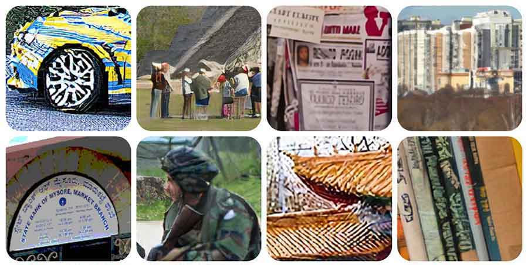

 

<!--# Bio

I received a Bachelor degree in Computer Science and Engineering at The Chinese University of Hong Kong, Shenzhen (CUHKSZ) in 2021.    
I am a Ph.D. student at the Hong Kong University of Science and Technology (Guangzhou) advised by [Prof. Lei Zhu](https://sites.google.com/site/indexlzhu/home).   
Mainly intrest in computer vision, especially in **Low-level Vision**.

[Google Scholar](https://scholar.google.com/citations?&user=KWbcBucAAAAJ) &nbsp;&nbsp;&nbsp;
[GitHub](https://github.com/haoyuc) &nbsp;&nbsp;&nbsp;
[Email](mailto:hchen794@connect.hkust-gz.edu.cn)

-->

  <!-- 左侧个人信息 -->
  

    

      
    

    
    

      

        
        <a href="mailto:hchen794@connect.hkust-gz.edu.cn" class="link-effect" style="color:#333; font-size:0.9em;">E-mail</a>
      

      
      

        
        <a href="https://scholar.google.com/citations?user=KWbcBucAAAAJ" class="link-effect" style="color:#333; font-size:0.9em;">Google Scholar</a>
      

      
      

        
        <a href="https://github.com/haoyuc" class="link-effect" style="color:#333; font-size:0.9em;">GitHub</a>
      

      
      

        
        WeChat: @haoyuc98
      

    

    
    

  

  <!-- 右侧内容 -->
  

    <h1 style="margin-top:0; margin-bottom:5px; font-size:2em; color:#293845;">陈浩宇 Haoyu Chen</h1>
    
PhD student @ HKUST(GZ)

    
    

      
我于2021年获得香港中文大学（深圳）计算机科学与工程专业学士学位。

      
目前是香港科技大学（广州）的博士生，导师为<a href="https://sites.google.com/site/indexlzhu/home?authuser=0">朱雷教授</a>和<a href="https://scholar.google.com/citations?user=XhyKVFMAAAAJ&hl=en">谭平教授</a>。

      
主要研究领域为计算机视觉，特别是低层次视觉、图像处理、多模态模型和生成模型。

    

  

<h2 style="color:#293845; font-size:1.6em; border-left:4px solid #0070c9; padding-left:10px; margin-top:40px; margin-bottom:25px;">发表论文 Publications</h2>

  

  <h3 style="margin:0; font-size:1.2em; color:#293845;">生成模型与人工智能内容生成 (Generative Models and AIGC)</h3>

  

    
  

  
  

    
CVPR 2025

    
    <h3 style="margin:0 0 10px 0; font-size:1.2em; color:#293845; line-height:1.4;">POSTA: 定制艺术海报生成的通用框架</h3>
    
POSTA: A Go-to Framework for Customized Artistic Poster Generation

    
    

      陈浩宇*, 徐小杰*, 李文博, 任晶晶, 叶天, 刘松华, 陈颖聪, 朱雷, 王鑫超
    

    
    

      <a href="https://haoyuchen.com/POSTA" class="pub-button" style="display:inline-block; background:#0070c9; color:white; padding:6px 12px; border-radius:4px; font-size:0.85em; margin-right:8px; text-decoration:none; transition:background 0.2s ease;" onmouseover="this.style.background='#005ba4'" onmouseout="this.style.background='#0070c9'">项目主页</a>
      
      <a href="https://arxiv.org/abs/2503.14908" class="pub-button" style="display:inline-block; background:#f5f5f5; color:#333; padding:6px 12px; border-radius:4px; font-size:0.85em; margin-right:8px; text-decoration:none; transition:background 0.2s ease;" onmouseover="this.style.background='#e8e8e8'" onmouseout="this.style.background='#f5f5f5'">论文</a>
    

  

<!-- =================================================================================== -->
  <tr>
    <td style="margin:5px;padding:5px;width:30%;max-width:30%" align="center" class="image-wrapper">
      
    </td>
    <td width="75%" valign="center" class="text-wrapper"> 
      
NeurIPS, 2024

      

        UltraPixel: Advancing Ultra-High-Resolution Image Synthesis to New Peaks
      

      

      Jingjing Ren*, Wenbo Li*, Haoyu Chen, Renjing Pei, Bin Shao, Yong Guo, Long Peng, Lei Zhu
      

      <!-- <em>ACM Multimedia <strong>(ACM MM)</strong></em>, 2023 -->
     <!--   -->
      <a href="https://jingjingrenabc.github.io/ultrapixel/">[Website]</a> 
      <a href="https://arxiv.org/abs/2407.02158">[arxiv]</a> 
      <a href="https://github.com/catcathh/UltraPixel">[Code]</a>
      <a href="https://huggingface.co/spaces/roubaofeipi/UltraPixel-demo">[Demo]</a> 
      <!-- <a href="https://www.jasongt.com/research-full">[CVPR 2022 NTIRE Challenge]</a>  -->
      <!-- <a href="https://www.youtube.com/watch?v=315Umwgpa6s">[Youtube]</a>  -->
      <!-- <a href="https://www.bilibili.com/video/BV1cr4y1P7s4">[Bilibili]</a>  -->
       
      <!-- 
 
          We propose a novel machine learning problem – the SRP problem as reconstructing high-quality data from unsatisfactory sensor data in industrial systems. 
      
 -->
    </td>
</tr>
<!-- =================================================================================== -->

<!-- =================================================================================== -->
  <tr>
    <td style="margin:5px;padding:5px;width:30%;max-width:30%" align="center" class="image-wrapper">
      
    </td>
    <td width="75%" valign="center" class="text-wrapper"> 
      
arXiv, 2023

      

        Towards Flexible, Scalable, and Adaptive Multi-Modal Conditioned Face Synthesis
      

      

      Jingjing Ren, Cheng Xu, Haoyu Chen, Xinran Qin, Chongyi Li, Lei Zhu
      

      

      <!-- <em>ACM Multimedia <strong>(ACM MM)</strong></em>, 2023 -->
      <a href="https://jingjingrenabc.github.io/multimodal-face-synthesis/">[Website]</a> 
      <a href="https://arxiv.org/abs/2312.16274">[arxiv]</a> 
      <!-- <a href="">[Code]</a> -->
      <!-- <a href="https://paperswithcode.com/dataset/pipal-perceptual-iqa-dataset">[Benchmark]</a>  -->
      <!-- <a href="https://www.jasongt.com/research-full">[CVPR 2022 NTIRE Challenge]</a>  -->
      <!-- <a href="https://www.youtube.com/watch?v=315Umwgpa6s">[Youtube]</a>  -->
      <!-- <a href="https://www.bilibili.com/video/BV1cr4y1P7s4">[Bilibili]</a>  -->
      

      <!--   -->
      <!-- 
 
          We propose a novel machine learning problem – the SRP problem as reconstructing high-quality data from unsatisfactory sensor data in industrial systems. 
      
 -->
    </td>
</tr>
<!-- =================================================================================== -->

    </tbody>
</table>

 
&nbsp;&nbsp;  Multi-Modal Models and Agents

<table style="width:100%;border:0px;border-spacing:0px;border-collapse:separate;margin-right:auto;margin-left:auto;"><tbody>

<!-- =================================================================================== -->
  <tr>
    <td style="margin:5px;padding:5px;width:30%;max-width:30%" align="center" class="image-wrapper">
      
    </td>
    <td width="75%" valign="center" class="text-wrapper"> 
      
NeurIPS, 2024

      

        RestoreAgent: Autonomous Image Restoration Agent via Multimodal Large Language Models
      

      

      Haoyu Chen, Wenbo Li, Jinjin Gu, Jingjing Ren, Sixiang Chen, Tian Ye, Renjing Pei, Kaiwen Zhou, Fenglong Song, Lei Zhu
      

      <!-- <em>ACM Multimedia <strong>(ACM MM)</strong></em>, 2023 -->
     <!--   -->
      <a href="https://haoyuchen.com/RestoreAgent">[Website]</a> 
      <a href="https://arxiv.org/abs/2407.18035">[arxiv]</a> 
      <!-- <a href="https://github.com/catcathh/UltraPixel">[Code]</a> -->
      <!-- <a href="https://paperswithcode.com/dataset/pipal-perceptual-iqa-dataset">[Benchmark]</a>  -->
      <!-- <a href="https://www.jasongt.com/research-full">[CVPR 2022 NTIRE Challenge]</a>  -->
      <!-- <a href="https://www.youtube.com/watch?v=315Umwgpa6s">[Youtube]</a>  -->
      <!-- <a href="https://www.bilibili.com/video/BV1cr4y1P7s4">[Bilibili]</a>  -->
       
      <!-- 
 
          We propose a novel machine learning problem – the SRP problem as reconstructing high-quality data from unsatisfactory sensor data in industrial systems. 
      
 -->
    </td>
</tr>
<!-- =================================================================================== -->

<!-- =================================================================================== -->
  <tr>
    <td style="margin:5px;padding:5px;width:30%;max-width:30%" align="center" class="image-wrapper">
      
    </td>
    <td width="75%" valign="center" class="text-wrapper"> 
      
CVPR, 2025

      

        JarvisIR: Elevating Autonomous Driving Perception with Intelligent Image Restoration
      

      

      Yunlong Lin*, Zixu Lin*, Haoyu Chen*, Panwang Pan*,  Chenxin Li, Sixiang Chen, Kairun Wen, Yeying Jin, Wenbo Li, Xinghao Ding
      

      <!-- <em>ACM Multimedia <strong>(ACM MM)</strong></em>, 2023 -->
     <!--   -->
      <!-- <a href="https://haoyuchen.com/RestoreAgent">[Website]</a>  -->
      <!-- <a href="https://arxiv.org/abs/2407.18035">[arxiv]</a>  -->
      <!-- <a href="https://github.com/catcathh/UltraPixel">[Code]</a> -->
      <!-- <a href="https://paperswithcode.com/dataset/pipal-perceptual-iqa-dataset">[Benchmark]</a>  -->
      <!-- <a href="https://www.jasongt.com/research-full">[CVPR 2022 NTIRE Challenge]</a>  -->
      <!-- <a href="https://www.youtube.com/watch?v=315Umwgpa6s">[Youtube]</a>  -->
      <!-- <a href="https://www.bilibili.com/video/BV1cr4y1P7s4">[Bilibili]</a>  -->
       
      <!-- 
 
          We propose a novel machine learning problem – the SRP problem as reconstructing high-quality data from unsatisfactory sensor data in industrial systems. 
      
 -->
    </td>
</tr>
<!-- =================================================================================== -->

    </tbody>
</table>

 
&nbsp;&nbsp;  Generalizable Image Restoration

<table style="width:100%;border:0px;border-spacing:0px;border-collapse:separate;margin-right:auto;margin-left:auto;"><tbody>

<!-- =================================================================================== -->
  <tr>
    <td style="margin:5px;padding:5px;width:30%;max-width:30%" align="center" class="image-wrapper">
      
    </td>
    <td width="75%" valign="center" class="text-wrapper"> 
      
CVPR, 2024

      

        Low-Res Leads the Way: Improving Generalization for Super-Resolution by Self-Supervised Learning
      

      

      Haoyu Chen, Wenbo Li, Jinjin Gu, Jingjing Ren, Haoze Sun, Xueyi Zou, Youliang Yan, Zhensong Zhang, Lei Zhu
      

      <!-- <em>ACM Multimedia <strong>(ACM MM)</strong></em>, 2023 -->
     <!--   -->
      <a href="https://haoyuchen.com/LWay">[Website]</a> 
      <a href="https://arxiv.org/abs/2403.02601">[arxiv]</a> 
      <!-- <a href="">[Code]</a> -->
      <!-- <a href="https://paperswithcode.com/dataset/pipal-perceptual-iqa-dataset">[Benchmark]</a>  -->
      <!-- <a href="https://www.jasongt.com/research-full">[CVPR 2022 NTIRE Challenge]</a>  -->
      <!-- <a href="https://www.youtube.com/watch?v=315Umwgpa6s">[Youtube]</a>  -->
      <!-- <a href="https://www.bilibili.com/video/BV1cr4y1P7s4">[Bilibili]</a>  -->
       
      <!-- 
 
          We propose a novel machine learning problem – the SRP problem as reconstructing high-quality data from unsatisfactory sensor data in industrial systems. 
      
 -->
    </td>
</tr>
<!-- =================================================================================== -->

  <!-- =================================================================================== -->
  <tr>
    <td style="margin:5px;padding:5px;width:30%;max-width:30%" align="center" class="image-wrapper">
      
    </td>
    <td width="75%" valign="center" class="text-wrapper"> 
      
CVPR, 2023

      

        Masked Image Training for Generalizable Deep Image Denoising
      

      

      Haoyu Chen*, Jinjin Gu*, Yihao Liu, Salma Abdel Magid, Chao Dong, Qiong Wang, Hanspeter Pfister, Lei Zhu
      

      <!-- <em>IEEE Conference on Computer Vision and Pattern Recognition <strong>(CVPR)</strong></em>, 2023 -->
      <!--   -->
      <!-- <a href="https://www.jasongt.com/projectpages/pipal.html">[Website]</a>  -->
      <a href="https://arxiv.org/abs/2303.13132">[arxiv]</a> 
      <a href="https://github.com/haoyuc/MaskedDenoising">[Code]</a>
      <!-- <a href="https://paperswithcode.com/dataset/pipal-perceptual-iqa-dataset">[Benchmark]</a>  -->
      <!-- <a href="https://www.jasongt.com/research-full">[CVPR 2022 NTIRE Challenge]</a>  -->
      <!-- <a href="https://www.youtube.com/watch?v=315Umwgpa6s">[Youtube]</a>  -->
      <!-- <a href="https://www.bilibili.com/video/BV1cr4y1P7s4">[Bilibili]</a>  -->
   
      <!-- 
 
          We propose a novel machine learning problem – the SRP problem as reconstructing high-quality data from unsatisfactory sensor data in industrial systems. 
      
 -->
    </td>
</tr>
<!-- =================================================================================== -->

<!-- =================================================================================== -->
  <tr>
    <td style="margin:5px;padding:5px;width:30%;max-width:30%" align="center" class="image-wrapper">
      
    </td>
    <td width="75%" valign="center" class="text-wrapper"> 
      
CVPR, 2024

      

        CoSeR: Bridging Image and Language for Cognitive Super-Resolution
      

      

      Haoze Sun, Wenbo Li, Jianzhuang Liu, Haoyu Chen, Renjing Pei, Xueyi Zou, Youliang Yan, Yujiu Yang
      

      <!-- <em>ACM Multimedia <strong>(ACM MM)</strong></em>, 2023 -->
     <!--   -->
      <a href="https://coser-main.github.io/">[Website]</a> 
      <a href="https://arxiv.org/abs/2311.16512">[arxiv]</a> 
      <a href="https://github.com/TianheWu/CoSeR">[Code]</a>
      <!-- <a href="https://paperswithcode.com/dataset/pipal-perceptual-iqa-dataset">[Benchmark]</a>  -->
      <!-- <a href="https://www.jasongt.com/research-full">[CVPR 2022 NTIRE Challenge]</a>  -->
      <!-- <a href="https://www.youtube.com/watch?v=315Umwgpa6s">[Youtube]</a>  -->
      <!-- <a href="https://www.bilibili.com/video/BV1cr4y1P7s4">[Bilibili]</a>  -->
       
      <!-- 
 
          We propose a novel machine learning problem – the SRP problem as reconstructing high-quality data from unsatisfactory sensor data in industrial systems. 
      
 -->
    </td>
</tr>
<!-- =================================================================================== -->

  <!-- =================================================================================== -->
  <tr>
    <td style="margin:5px;padding:5px;width:30%;max-width:30%" align="center" class="image-wrapper">
      
    </td>
    <td width="75%" valign="center" class="text-wrapper"> 
      
ICML, 2023

      

        Crafting Training Degradation Distribution for the Accuracy-Generalization Trade-off in Real-World Super-Resolution
      

      

      Ruofan Zhang, Jinjin Gu, Haoyu Chen, Chao Dong, Yulun Zhang, Wenming Yang
      

      <!-- <em>International Conference on Machine Learning <strong>(ICML)</strong></em>, 2023 -->
      <!--   -->
      <!-- <a href="https://www.jasongt.com/projectpages/pipal.html">[Website]</a>  -->
      <a href="https://arxiv.org/abs/2305.18107">[arxiv]</a> 
      <a href="">[Code]</a>
      <!-- <a href="https://paperswithcode.com/dataset/pipal-perceptual-iqa-dataset">[Benchmark]</a>  -->
      <!-- <a href="https://www.jasongt.com/research-full">[CVPR 2022 NTIRE Challenge]</a>  -->
      <!-- <a href="https://www.youtube.com/watch?v=315Umwgpa6s">[Youtube]</a>  -->
      <!-- <a href="https://www.bilibili.com/video/BV1cr4y1P7s4">[Bilibili]</a>  -->
   
      <!-- 
 
          We propose a novel machine learning problem – the SRP problem as reconstructing high-quality data from unsatisfactory sensor data in industrial systems. 
      
 -->
    </td>
</tr>
<!-- =================================================================================== -->

  

  <!-- =================================================================================== -->
  <tr>
    <td style="padding:5px;width:30%;max-width:30%" align="center" class="image-wrapper">
      
    </td>
    <td width="75%" valign="center"  class="text-wrapper">
      
arXiv, 2021

      

        Attention in Attention Network for Image Super-Resolution
      

      

      Haoyu Chen, Jinjin Gu, Zhi Zhang
      

      <!-- <em>arXiv</em>, 2021 -->
      <!--   -->
      <!-- <a href="https://www.jasongt.com/projectpages/pipal.html">[Website]</a>  -->
      <a href="https://arxiv.org/abs/2104.09497">[arxiv]</a> 
      <a href="https://github.com/haoyuc/A2N">[Code]</a>
      <!-- <a href="https://paperswithcode.com/dataset/pipal-perceptual-iqa-dataset">[Benchmark]</a>  -->
      <!-- <a href="https://www.jasongt.com/research-full">[CVPR 2022 NTIRE Challenge]</a>  -->
      <!-- <a href="https://www.youtube.com/watch?v=315Umwgpa6s">[Youtube]</a>  -->
      <!-- <a href="https://www.bilibili.com/video/BV1cr4y1P7s4">[Bilibili]</a>  -->
   
      <!-- 
 
          We propose a novel machine learning problem – the SRP problem as reconstructing high-quality data from unsatisfactory sensor data in industrial systems. 
      
 -->
    </td>
</tr>
<!-- =================================================================================== -->

  <!-- =================================================================================== -->
  <tr>
      <td style="margin:5px;padding:5px;width:30%;max-width:30%" align="center" class="image-wrapper">
        
      </td>
      <td width="75%" valign="center" class="text-wrapper">
        
ECCV, 2020

        

          PIPAL: a Large-Scale Image Quality Assessment Dataset for Perceptual Image Restoration
        

      

        Jinjin Gu, Haoming Cai, Haoyu Chen, Xiaoxin Ye, Jimmy S.Ren, Chao Dong
      

        <!-- <em>European Conference on Computer Vision  <strong>(ECCV)</strong></em>, 2020 -->
        <!--   -->
        <a href="https://www.jasongt.com/projectpages/pipal.html">[Website]</a> 
        <a href="https://arxiv.org/abs/2007.12142">[arxiv]</a> 
        <a href="https://github.com/HaomingCai/PIPAL-Codebase">[Code]</a>
        <a href="https://paperswithcode.com/dataset/pipal-perceptual-iqa-dataset">[Benchmark]</a> 
        <a href="https://www.jasongt.com/research-full">[CVPR 2022 NTIRE Challenge]</a> 
        <a href="https://www.youtube.com/watch?v=315Umwgpa6s">[Youtube]</a> 
        <a href="https://www.bilibili.com/video/BV1cr4y1P7s4">[Bilibili]</a> 
     
        <!-- 
 
            We propose a novel machine learning problem – the SRP problem as reconstructing high-quality data from unsatisfactory sensor data in industrial systems. 
        
 -->
      </td>
  </tr>
  <!-- =================================================================================== -->

    
    </tbody>
</table>

 
&nbsp;&nbsp;  Adverse Weather Restoration

<table style="width:100%;border:0px;border-spacing:0px;border-collapse:separate;margin-right:auto;margin-left:auto;"><tbody>

  <!-- =================================================================================== -->
  <tr>
    <td style="margin:5px;padding:5px;width:30%;max-width:30%" align="center" class="image-wrapper">
      
    </td>
    <td width="75%" valign="center" class="text-wrapper"> 
      
ICCV, 2023

      

        Snow Removal in Video: A New Dataset and A Novel Method
      

      

      Haoyu Chen, Jingjing Ren, Jinjin Gu, Hongtao Wu, Xuequan Lu, Haoming Cai, Lei Zhu
      

      <!-- <em>International Conference on Computer Vision <strong>(ICCV)</strong></em>, 2023 -->
      <!--   -->
      <!-- <a href="https://www.jasongt.com/projectpages/pipal.html">[Website]</a>  -->
      <a href="https://openaccess.thecvf.com/content/ICCV2023/html/Chen_Snow_Removal_in_Video_A_New_Dataset_and_A_Novel_ICCV_2023_paper.html">[arxiv]</a> 
      <a href="https://github.com/haoyuc/VideoDesnowing">[Code]</a>
      <a href="https://haoyuchen.com/VideoDesnowing">[Dataset]</a>
      <!-- <a href="https://paperswithcode.com/dataset/pipal-perceptual-iqa-dataset">[Benchmark]</a>  -->
      <!-- <a href="https://www.jasongt.com/research-full">[CVPR 2022 NTIRE Challenge]</a>  -->
      <!-- <a href="https://www.youtube.com/watch?v=315Umwgpa6s">[Youtube]</a>  -->
      <!-- <a href="https://www.bilibili.com/video/BV1cr4y1P7s4">[Bilibili]</a>  -->
   
      <!-- 
 
          We propose a novel machine learning problem – the SRP problem as reconstructing high-quality data from unsatisfactory sensor data in industrial systems. 
      
 -->
    </td>
</tr>
<!-- =================================================================================== -->

  <!-- =================================================================================== -->
  <tr>
    <td style="margin:5px;padding:5px;width:30%;max-width:30%" align="center" class="image-wrapper">
      
    </td>
    <td width="75%" valign="center" class="text-wrapper"> 
      
IJCV, 2024

      

        Triplane-Smoothed Video Dehazing with CLIP-Enhanced Generalization
      

      

      Jingjing Ren, Haoyu Chen, Tian Ye, Hongtao Wu, Lei Zhu
      

      <!-- <em>International Conference on Computer Vision <strong>(ICCV)</strong></em>, 2023 -->
      <!--   -->
      <!-- <a href="https://www.jasongt.com/projectpages/pipal.html">[Website]</a>  -->
      <a href="https://link.springer.com/article/10.1007/s11263-024-02161-0">[paper]</a> 
      <!-- <a href="https://github.com/haoyuc/VideoDesnowing">[Code]</a> -->
      <!-- <a href="https://haoyuchen.com/VideoDesnowing">[Dataset]</a> -->
      <!-- <a href="https://paperswithcode.com/dataset/pipal-perceptual-iqa-dataset">[Benchmark]</a>  -->
      <!-- <a href="https://www.jasongt.com/research-full">[CVPR 2022 NTIRE Challenge]</a>  -->
      <!-- <a href="https://www.youtube.com/watch?v=315Umwgpa6s">[Youtube]</a>  -->
      <!-- <a href="https://www.bilibili.com/video/BV1cr4y1P7s4">[Bilibili]</a>  -->
   
      <!-- 
 
          We propose a novel machine learning problem – the SRP problem as reconstructing high-quality data from unsatisfactory sensor data in industrial systems. 
      
 -->
    </td>
</tr>
<!-- =================================================================================== -->

<!-- =================================================================================== -->
  <tr>
    <td style="margin:5px;padding:5px;width:30%;max-width:30%" align="center" class="image-wrapper">
      
    </td>
    <td width="75%" valign="center" class="text-wrapper"> 
      
ECCV, 2024

      

        Semi-Supervised Video Desnowing Network via Temporal Decoupling Experts and Distribution-Driven Contrastive Regularization
      

      

      Hongtao Wu, Yijun Yang, Angelica Aviles-Rivero, Jingjing Ren, Sixiang Chen, Haoyu Chen, Lei Zhu
      

      <!-- <em>ACM Multimedia <strong>(ACM MM)</strong></em>, 2023 -->
     <!--   -->
      <!-- <a href="https://haoyuchen.com/LWay">[Website]</a>  -->
      <!-- <a href="https://arxiv.org/abs/2403.02601">[arxiv]</a>  -->
      <!-- <a href="">[Code]</a> -->
      <!-- <a href="https://paperswithcode.com/dataset/pipal-perceptual-iqa-dataset">[Benchmark]</a>  -->
      <!-- <a href="https://www.jasongt.com/research-full">[CVPR 2022 NTIRE Challenge]</a>  -->
      <!-- <a href="https://www.youtube.com/watch?v=315Umwgpa6s">[Youtube]</a>  -->
      <!-- <a href="https://www.bilibili.com/video/BV1cr4y1P7s4">[Bilibili]</a>  -->
       
      <!-- 
 
          We propose a novel machine learning problem – the SRP problem as reconstructing high-quality data from unsatisfactory sensor data in industrial systems. 
      
 -->
    </td>
</tr>
<!-- =================================================================================== -->

  <!-- =================================================================================== -->
  <tr>
    <td style="margin:5px;padding:5px;width:30%;max-width:30%" align="center" class="image-wrapper">
      
    </td>
    <td width="75%" valign="center" class="text-wrapper"> 
      
ACM MM, 2023

      

        Mask-Guided Progressive Network for Joint Raindrop and Rain Streak Removal in Videos
      

      

      Hongtao Wu, Yijun Yang, Haoyu Chen, Jingjing Ren, Lei Zhu
      

      <!-- <em>ACM Multimedia <strong>(ACM MM)</strong></em>, 2023 -->
     <!--   -->
      <!-- <a href="https://www.jasongt.com/projectpages/pipal.html">[Website]</a>  -->
      <a href="https://dl.acm.org/doi/pdf/10.1145/3581783.3612001">[paper]</a> 
      <!-- <a href="">[Code]</a> -->
      <!-- <a href="https://paperswithcode.com/dataset/pipal-perceptual-iqa-dataset">[Benchmark]</a>  -->
      <!-- <a href="https://www.jasongt.com/research-full">[CVPR 2022 NTIRE Challenge]</a>  -->
      <!-- <a href="https://www.youtube.com/watch?v=315Umwgpa6s">[Youtube]</a>  -->
      <!-- <a href="https://www.bilibili.com/video/BV1cr4y1P7s4">[Bilibili]</a>  -->
       
      <!-- 
 
          We propose a novel machine learning problem – the SRP problem as reconstructing high-quality data from unsatisfactory sensor data in industrial systems. 
      
 -->
    </td>
</tr>
<!-- =================================================================================== -->

    

  <!-- =================================================================================== -->
  <tr>
    <td style="margin:5px;padding:5px;width:30%;max-width:30%" align="center" class="image-wrapper">
      
    </td>
    <td width="75%" valign="center" class="text-wrapper"> 
      
ACM MM, 2023

      

        Uncertainty-Driven Dynamic Degradation Perceiving and Background Modeling for Efficient Single Image Desnowing
      

      

      Sixiang Chen*, Tian Ye*, Chenghao Xue, Haoyu Chen, Yun Liu, Erkang Chen, Lei Zhu
      

      <!-- <em>ACM Multimedia <strong>(ACM MM)</strong></em>, 2023 -->
      <!--   -->
      <!-- <a href="https://www.jasongt.com/projectpages/pipal.html">[Website]</a>  -->
      <a href="https://dl.acm.org/pdf/10.1145/3581783.3612003">[paper]</a> 
      <!-- <a href="">[Code]</a> -->
      <!-- <a href="https://paperswithcode.com/dataset/pipal-perceptual-iqa-dataset">[Benchmark]</a>  -->
      <!-- <a href="https://www.jasongt.com/research-full">[CVPR 2022 NTIRE Challenge]</a>  -->
      <!-- <a href="https://www.youtube.com/watch?v=315Umwgpa6s">[Youtube]</a>  -->
      <!-- <a href="https://www.bilibili.com/video/BV1cr4y1P7s4">[Bilibili]</a>  -->
   
      <!-- 
 
          We propose a novel machine learning problem – the SRP problem as reconstructing high-quality data from unsatisfactory sensor data in industrial systems. 
      
 -->
    </td>
</tr>
<!-- =================================================================================== -->

  <!-- =================================================================================== -->
  <tr>
    <td style="margin:5px;padding:5px;width:30%;max-width:30%" align="center" class="image-wrapper">
      
    </td>
    <td width="75%" valign="center" class="text-wrapper"> 
      
ACM MM, 2023

      

        Cross-scale Prototype Learning Transformer for Image Snow Removal
      

      

      Sixiang Chen*, Tian Ye*, Yun Liu, Jinbin Bai, Haoyu Chen, Yunlong Lin, Jun Shi, Erkang Chen
      

      <!-- <em>ACM Multimedia <strong>(ACM MM)</strong></em>, 2023 -->
    <!--   -->
      <!-- <a href="https://www.jasongt.com/projectpages/pipal.html">[Website]</a>  -->
      <a href="https://dl.acm.org/doi/pdf/10.1145/3581783.3611893">[paper]</a> 
      <!-- <a href="">[Code]</a> -->
      <!-- <a href="https://paperswithcode.com/dataset/pipal-perceptual-iqa-dataset">[Benchmark]</a>  -->
      <!-- <a href="https://www.jasongt.com/research-full">[CVPR 2022 NTIRE Challenge]</a>  -->
      <!-- <a href="https://www.youtube.com/watch?v=315Umwgpa6s">[Youtube]</a>  -->
      <!-- <a href="https://www.bilibili.com/video/BV1cr4y1P7s4">[Bilibili]</a>  -->
   
      <!-- 
 
          We propose a novel machine learning problem – the SRP problem as reconstructing high-quality data from unsatisfactory sensor data in industrial systems. 
      
 -->
    </td>
</tr>
<!-- =================================================================================== -->

    
    </tbody>
</table>

 
&nbsp;&nbsp;  Other

<table style="width:100%;border:0px;border-spacing:0px;border-collapse:separate;margin-right:auto;margin-left:auto;"><tbody>

  <!-- =================================================================================== -->
  <tr>
        <td style="margin:5px;padding:5px;width:30%;max-width:30%" align="center" class="image-wrapper">
          
        </td>
        <td width="75%" valign="center"  class="text-wrapper">
        
arXiv, 2018

        

        Super-resolution perception for industrial sensor data
      

      

        Jinjin Gu, Haoyu Chen, Guolong Liu, Gaoqi Liang, Xinlei Wang, Junhua Zhao             
      

        <!-- <em>arXiv</em>, 2018 -->
        <!--   -->
        <!-- <a href="https://sstzal.github.io/DFRF/">[Website]</a>  -->
        <a href="https://arxiv.org/abs/1809.06687">[arxiv]</a> 
        <!-- <a href="https://www.youtube.com/watch?v=F6fkVNk9bBw&amp;ab_channel=Shens">[Video]</a>  -->
        <!-- <a href="https://github.com/sstzal/DFRF">[Code]</a> -->
         
        <!-- 
 
          We propose a novel machine learning problem – the SRP problem as reconstructing high-quality data from unsatisfactory sensor data in industrial systems. 
        
 -->
      </td>
  </tr>
    <!-- =================================================================================== -->

    </tbody>
</table>

 

# Experience 

<h2 style="color:#293845; font-size:1.6em; border-left:4px solid #0070c9; padding-left:10px; margin-top:40px; margin-bottom:25px;">工作经历 Experience</h2>

  

    

      
    

    

      <h3 style="margin:0 0 8px 0; font-size:1.2em; color:#293845;">小冰人工智能 Xiaobing.AI</h3>
      
2021.6 - 2022.2 研究实习生

      
导师：<a href="https://scholar.google.com.hk/citations?user=OWa5rOEAAAAJ" target="_blank">王宝元博士</a>

    

  

  
  

    

      
    

    

      <h3 style="margin:0 0 8px 0; font-size:1.2em; color:#293845;">亚马逊AWS上海AI实验室</h3>
      
2020.5 - 2020.11 软件开发工程师实习生

      
导师：<a href="https://scholar.google.com.hk/citations?user=nZr0oXQAAAAJ" target="_blank">张志博士</a>

    

  

# Academic Service & Awards

<h2 style="color:#293845; font-size:1.6em; border-left:4px solid #0070c9; padding-left:10px; margin-top:40px; margin-bottom:25px;">学术服务与奖项 Academic Service & Awards</h2>

  

    <h3 style="margin:0 0 15px 0; font-size:1.1em; color:#293845; border-bottom:2px solid #0070c9; padding-bottom:8px; display:inline-block;">竞赛获奖</h3>
    
    <ul style="padding-left:20px; margin:0; color:#555; font-size:0.95em;">
      <li style="margin-bottom:8px;">IEEE ICDM 2018全球AI气象挑战赛，第一名</li>
      <li style="margin-bottom:8px;">ECCV 2020 Workshop, AIM 2020极限超分辨率挑战赛，第四名</li>
    </ul>
  

  
  

    <h3 style="margin:0 0 15px 0; font-size:1.1em; color:#293845; border-bottom:2px solid #0070c9; padding-bottom:8px; display:inline-block;">程序委员会/审稿人</h3>
    
    <ul style="padding-left:0; list-style-type:none; margin:0; color:#555; font-size:0.95em;">
      <li style="margin-bottom:6px;">IEEE计算机视觉与模式识别会议 (CVPR), 2024</li>
      <li style="margin-bottom:6px;">欧洲计算机视觉会议 (ECCV), 2024</li>
      <li style="margin-bottom:6px;">国际学习表示会议 (ICLR), 2025</li>
      <li style="margin-bottom:6px;">ACM多媒体会议 (ACM MM), 2023, 2024</li>
      <li style="margin-bottom:6px;">ACM SIGKDD数据挖掘会议 (KDD), 2023</li>
      <li style="margin-bottom:6px;">SIAM数据挖掘国际会议 (SDM), 2024</li>
      <li style="margin-bottom:6px;">计算机视觉应用冬季会议 (WACV), 2023, 2024</li>
      <li style="margin-bottom:6px;">ACM SIGGRAPH VRCAI, 2022</li>
      <li style="margin-bottom:6px;">IEEE电路与系统视频技术汇刊</li>
      <li style="margin-bottom:6px;">IEEE移动计算汇刊</li>
      <li style="margin-bottom:6px;">计算机视觉期刊</li>
    </ul>
  

# Hobbies & Interests
<h2 style="color:#293845; font-size:1.6em; border-left:4px solid #0070c9; padding-left:10px; margin-top:40px; margin-bottom:25px;">兴趣爱好 Hobbies & Interests</h2>

  

    
    户外活动
  

  
  

    
    旅行
  

  
  

    
    网球
  

  
  

    
    音乐
  

<!--# Publications

Please refer to my [Publication](https://haoyuchen.com/portfolio/) or [Google Scholar](https://scholar.google.com/citations?&user=KWbcBucAAAAJ).

-->