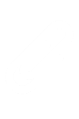
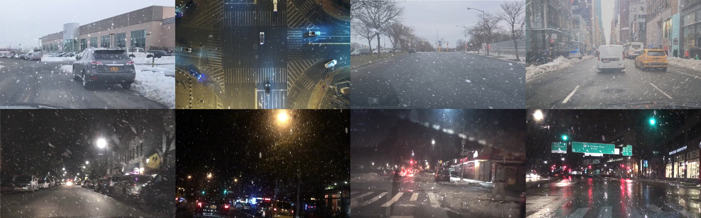

<h2 class="post-title" style="margin-bottom:7px;margin-top:10px;font-weight:700;">Snow Removal in Video: </h2>
<h2 class="post-title" style="margin-bottom:25px;margin-top:0;">A New Dataset and A Novel Method</h2>

<div class="post-authors" style="margin-bottom:5px;font-size:1.1em !important;">
<strong><a style="font-size:1.1em !important;" href="https://haoyuchen.com">Haoyu Chen</a></strong>, 
<a style="font-size:1.1em !important;" href="https://scholar.google.com/citations?hl=zh-CN&user=wcuqACgAAAAJ">Jingjing Ren</a>, 
<a style="font-size:1.1em !important;" href="https://www.jasongt.com/">Jinjin Gu</a>, Hongtao Wu, Xuequan Lu, 
<a style="font-size:1.1em !important;" href="https://www.haomingcai.com/">Haoming Cai</a>, 
<a style="font-size:1.1em !important;" href="https://sites.google.com/site/indexlzhu/home?authuser=0">Lei Zhu</a>
</div>

<div class="post-authors" style="margin-bottom:20px;">
International Conference on Computer Vision <strong>(ICCV)</strong>, 2023
</div>


<div style="margin-bottom: 0.7em;" class="post-authors">
                <div class="col-md-8 col-md-offset-2 text-center">
                    <ul class="nav nav-pills nav-justified" style="box-shadow:0 0">
                        <li>
                            <a href="">
                            <!-- <a href="https://arxiv.org/abs/2112.05504"> -->
                            
                                <h5><strong>arXiv</strong></h5>
                            </a>
                        </li>
                        <li>
                             <a href="">
                            
                                <h5><strong>ICCV 2023</strong></h5>
                            </a>
                        </li>
                        <li>
                             <a href="/VideoDesnowing#:~:text=Realistic Video DeSnowing Datase">
                            
                                <h5><strong>Dataset</strong></h5>
                            </a>
                        </li>                        
                        <li>
                            <a href="https://github.com/haoyuc/VideoDesnowing">
                            
                                <h5><strong>Code</strong></h5>
                            </a>
                        </li>
                        <li>
                             <a href="">
                            
                                <h5><strong>Supplementery</strong></h5>
                            </a>
                        </li>
                    </ul>
                </div>
        </div>


<!-- <div class="post-line"></div> -->


  <div class="post-img-group">
    
    
  </div>


<div style="background-color:#f0f1f3a6;">
<h2 class="post-section" style="
    padding-left: 25px;
    margin-bottom: 0px;
    padding-top: 20px;
">Abstract</h2>
<p style="
    padding: 25px;
    padding-top: 10px;
">Snowfall is a common weather phenomenon that can severely affect computer vision tasks by obscuring objects and scenes. However, existing deep learning-based snow removal methods are designed for single images only. In this paper, we target a more complex task – video snow removal, which aims to restore the clear video from the snowy video. To facilitate this task, we propose the first high-quality video dataset, which simulates realistic physical characteristics of snow and haze using a rendering engine and augmentation techniques. We also develop a deep learning framework for video snow removal. Specifically, we propose a snow-query temporal aggregation module and a snow-aware contrastive learning loss function. The module aggregates features between video frames and removes snow effectively, while the loss function helps identify and eliminate snow features. We conduct extensive experiments and demonstrate that our proposed dataset is more realistic than previous datasets, and the models trained on it achieve better performance in real-world snowing images. Our proposed method outperforms state-of-the-art video and image-based methods on both synthetic and real snowy videos.</p>


</div>

<!-- <h2 class="post-section" style="
    padding-left: 25px;
    background-color: #f0f1f3a6;
    margin-bottom: 0px;
    padding-top: 20px;
">Abstract</h2>
<p style="
    padding: 25px;
    background-color: #f0f1f3a6;
    padding-top: 10px;
">Snowfall is a common weather phenomenon that can severely affect computer vision tasks by obscuring objects and scenes. However, existing deep learning-based snow removal methods are designed for single images only. In this paper, we target a more complex task – video snow removal, which aims to restore the clear video from the snowy video. To facilitate this task, we propose the first high-quality video dataset, which simulates realistic physical characteristics of snow and haze using a rendering engine and augmentation techniques. We also develop a deep learning framework for video snow removal. Specifically, we propose a snow-query temporal aggregation module and a snow-aware contrastive learning loss function. The module aggregates features between video frames and removes snow effectively, while the loss function helps identify and eliminate snow features. We conduct extensive experiments and demonstrate that our proposed dataset is more realistic than previous datasets, and the models trained on it achieve better performance in real-world snowing images. Our proposed method outperforms state-of-the-art video and image-based methods on both synthetic and real snowy videos.</p>
 -->


<h2 class="post-section"  style="margin-top:35px;">Realistic Video DeSnowing Dataset</h2>

- <strong>R</strong>ealistic <strong>V</strong>ideo De<strong>S</strong>nowing <strong>D</strong>ataset<strong> (RVSD) </strong> contains a total of 110 pairs of videos. 
- Each pair contains <strong>snowy</strong> and  <strong>hazy</strong> videos and corresponding snow-free and haze-free ground truth videos. 
- We use a rendering engine (Unreal Engine 5) and various augmentation techniques to generate snow and haze with diverse and realistic physical properties. This results in more realistic and varied synthesized videos, which improve the model’s performance on real-world data.     


<p></p>


<div style="background-color:#f5f5f5a1;box-shadow:3px 6px 13px 0px rgba(0,0,0,0.5);margin-left:-5px;">
<div class="post-section" style="font-weight:700;margin-bottom: 0;padding: 20px;padding-left: 25px;padding-bottom:15px">RVSD Download</div>
<div class="container" style="display:flex;margin:0 0;width:100%;padding-left: 50px;padding-top: 0;padding-bottom:12px;">
    <div class="column" style="flex:1;">
        <p style="font-size:1.15em;font-weight:700;margin-bottom:5px;">Train (80 videos)</p>
        <p>[Google Drive] [Baidu Netdisk (password: 7t74)]</p>
    </div>
    <div class="column" style="flex:1;padding-left:30px;margin-right:15px">
        <p style="font-size:1.15em;font-weight:700;margin-bottom:5px;">Test (30 videos)</p>
        <p>[Google Drive] [Baidu Netdisk (password: 7t74)]</p>
    </div>
</div>
  <div class="post-img-group">
    
  </div>
</div>


<!-- <div class="post-section" style="font-weight:700;margin-bottom: 0;background-color: #f5f5f5a1;padding: 20px;padding-left: 25px;padding-bottom:15px">Dataset Download</div>
<div class="container" style="display:flex;margin:0 0;width:100%;padding-left: 50px;background-color: #f5f5f5a1;padding-top: 0;padding-bottom:12px;">
    <div class="column" style="flex:1;">
        <p style="font-size:1.15em;font-weight:700;margin-bottom:5px;">Train (80 videos)</p>
        <p>[Google Drive] [Baidu Netdisk (password: 7t74)]</p>
    </div>
    <div class="column" style="flex:1;padding-left:30px;margin-right:15px">
        <p style="font-size:1.15em;font-weight:700;margin-bottom:5px;">Test (30 videos)</p>
        <p>[Google Drive] [Baidu Netdisk (password: 7t74)]</p>
    </div>
</div>
  <div class="post-img-group">
    
  </div> -->


<h2 class="post-section" style="margin-top:50px">Citation</h2>


```
@inproceedings{chen2023desnow,
  title={Snow Removal in Video: A New Dataset and A Novel Method},
  author={Chen, Haoyu and Ren, Jingjing and Gu, Jinjin and Wu, Hongtao and Lu, Xuequan and Cai, Haoming and Zhu, Lei},
  booktitle={Proceedings of the IEEE/CVF International Conference on Computer Vision},
  year={2023}
}
```
